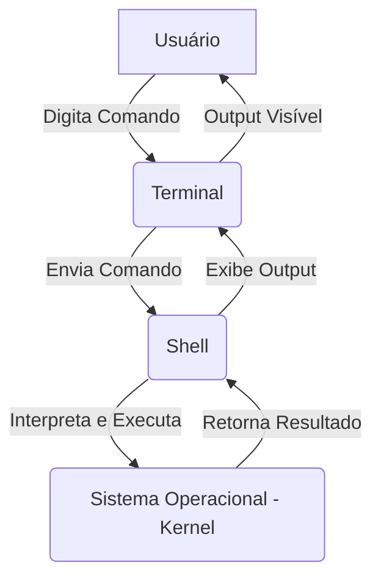
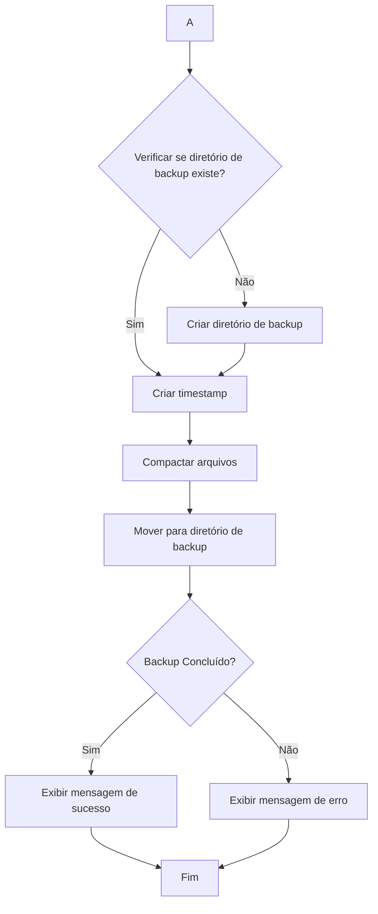
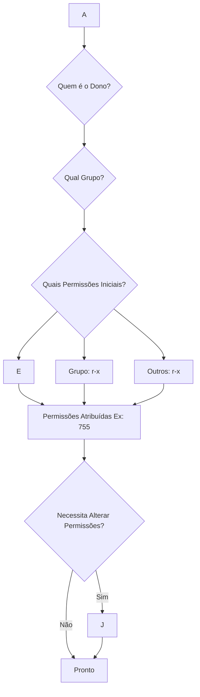
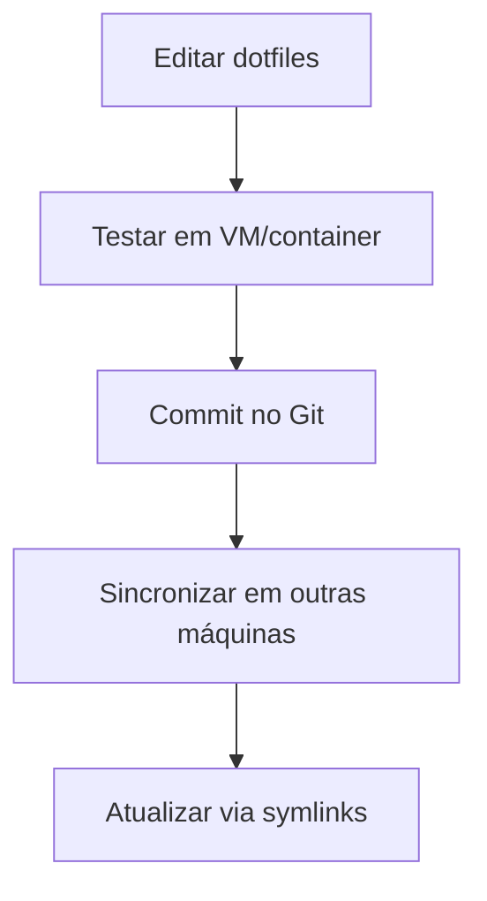
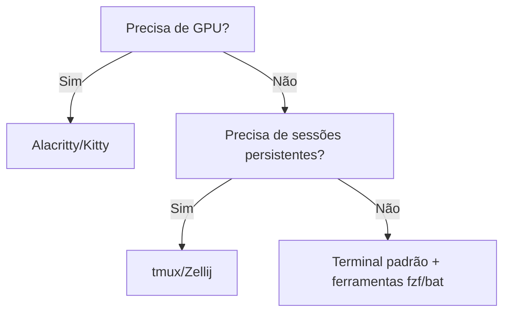
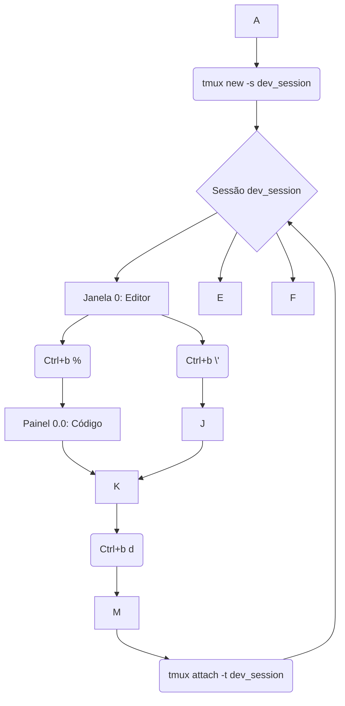

*Um Guia Prático e Estratégico para Desenvolvedores Modernos, com Analogias de Jogos e Automação Inteligente*

---

## **Introdução: O Ponto de Partida – Sua Base de Operações**

Imagine que o teclado é o controle de um poderoso console de jogos, e a tela preta do terminal é o vasto mundo onde as aventuras de desenvolvimento se desenrolam. Cada comando digitado não é apenas uma instrução, mas uma habilidade, um feitiço, um ataque especial que manipula o ambiente digital ao redor. O terminal não é uma relíquia do passado; é o joystick mais poderoso de um desenvolvedor, um atalho para a produtividade que muitos ainda não desbloquearam completamente.

Em um cenário tecnológico dominado por interfaces gráficas (GUIs), a linha de comando (CLI) pode, à primeira vista, parecer intimidante ou arcaica. No entanto, para o desenvolvedor que busca otimizar o fluxo de trabalho, automatizar tarefas repetitivas e resolver problemas complexos com agilidade, o terminal é uma ferramenta indispensável. Ele oferece um nível de controle e eficiência inigualável, permitindo que se "teleporte" entre diretórios, "conjure" scripts para realizar tarefas em segundos e "debugue" problemas com a precisão de um franco-atirador. A CLI é, de fato, uma interface fundamental para a interação com computadores, existindo antes mesmo do advento das GUIs. 

Para desenvolvedores, sua importância é inegável, sendo crucial para depurar scripts, instalar pacotes e gerenciar o controle de versão. A percepção inicial de dificuldade é rapidamente substituída pela compreensão de que dominar a linha de comando confere um poder significativo, transformando-a de uma ferramenta antiga em um instrumento de alta performance.

Esta jornada será dividida em cinco "Arcos de Missão", cada um desbloqueando um novo conjunto de habilidades e conhecimentos. Começar-se-á com os fundamentos, avançar-se-á para o fluxo de dados e ambiente, mergulhar-se-á na automação e scripting, aprimorar-se-ão as técnicas de otimização e manutenção e, finalmente, explorar-se-á um arsenal de ferramentas avançadas. A estrutura, inspirada em uma jornada de RPG, visa tornar o aprendizado envolvente e prático.

No universo dos RPGs, cada personagem escolhe uma classe e desenvolve habilidades. O terminal é a "Interface de Comando" , onde o Desenvolvedor Aventureiro interage com o "Kernel" do sistema operacional o coração do mundo de jogo. Cada comando é uma habilidade invocada para interagir com esse mundo. A conexão entre a produtividade e o "poder" que a CLI confere é uma metáfora central, elevando a linha de comando de uma mera ferramenta para um catalisador de "superpoderes" no dia a dia do desenvolvimento. 


---

## **Arco de Missão 1: Fundamentos do Terminal – Desbloqueando Habilidades Básicas**

Neste primeiro arco, estabelece-se a base da jornada. Como em qualquer RPG, é crucial entender o ambiente, escolher o personagem e familiarizar-se com as ferramentas mais básicas antes de enfrentar desafios maiores.


### **Missão 1.1: Shell, Terminal e CLI – Entendendo o Campo de Batalha**

A interação com sistemas operacionais através de uma interface de texto é um pilar fundamental da computação. Embora os termos "terminal", "console" e "shell" sejam frequentemente usados de forma intercambiável em tutoriais, compreender suas distinções técnicas é crucial para um domínio aprofundado e para evitar confusões à medida que se avança para tópicos mais complexos, como personalização de shell ou scripting.

#### Definições Essenciais e Suas Interações:

##### **CLI (Command Line Interface):** 
Representa a interface onde o usuário interage com o computador por meio de comandos de texto. Pode-se pensar nela como a "linguagem" utilizada para se comunicar diretamente com o sistema.

##### **Shell:** 
É um programa que serve como intérprete de comandos, aceitando as instruções do usuário, interpretando-as e passando-as para o sistema operacional para execução. É o "cérebro" que traduz as intenções do usuário em ações concretas.

##### **Terminal (ou Terminal Emulator):** 
É o programa que fornece a interface visual (a "tela e teclado") para interagir com o shell. Historicamente, eram dispositivos físicos, mas hoje são softwares que simulam esses dispositivos. É a "janela" para o mundo da linha de comando.

> **Analogia:** 
> Se o sistema operacional é o "mundo de jogo", o **Shell** é o "agente de comando" que entende as ordens, e o **Terminal** é a "tela e teclado" usados para dar essas ordens.

#### Bash\ vs. Zsh: Escolhendo seu "Personagem" e Suas "Classes"

A escolha do shell principal é uma decisão significativa que afeta a experiência de desenvolvimento, comparável à escolha de uma classe de personagem em um RPG.

##### **Bash (Bourne Again SHell):** 

É o shell mais popular e amplamente utilizado em sistemas Unix-like. É reconhecido por sua confiabilidade, simplicidade e compatibilidade POSIX, o que o torna uma escolha robusta para scripts e tarefas básicas. O Bash pode ser visto como um "Guerreiro" confiável: forte, direto e universalmente compreendido. Sua performance é otimizada para velocidade na execução de scripts.

##### **Zsh (Z Shell):** 

Uma alternativa mais moderna e sofisticada ao Bash, que oferece recursos avançados como auto-completar contextual, correção ortográfica, globbing aprimorado e um sistema de plugins robusto. O Zsh é como um "Mago" ou "Ladrão": mais personalizável, interativo e com truques extras para otimizar a experiência. Desde o macOS Catalina, o Zsh é o shell padrão no macOS. Embora ligeiramente mais lento para execução de scripts do que o Bash, essa diferença é geralmente insignificante para a maioria dos usuários, e o Zsh compensa com recursos interativos que aumentam a produtividade diária.

A decisão entre Bash e Zsh depende do estilo de jogo do usuário. Se a prioridade é estabilidade e portabilidade para scripts, o Bash é uma excelente opção. Se a busca é por interatividade, personalização e recursos modernos para o uso diário, o Zsh (com frameworks como Oh My Zsh) é a escolha ideal. 

A escolha da "classe" do personagem (shell) deve ser baseada no estilo de jogo (fluxo de trabalho) do jogador (desenvolvedor).



### **Missão 1.2: Comandos Essenciais – Seu Kit de Ferramentas Inicial**

Familiarizar-se com os comandos básicos é o primeiro passo para qualquer aventureiro. Este "kit de ferramentas inicial" permite explorar o ambiente, manipular recursos e monitorar o estado do "reino".

#### Navegação (cd, pwd, ls): Explorando o "Mapa" do Sistema de Arquivos

Navegar no sistema de arquivos é como explorar um calabouço. Os comandos de navegação são as ferramentas essenciais para se orientar e mover-se eficientemente.

| Comando | Descrição                                                                                                                                  | Analogia                        |
| ------- | ------------------------------------------------------------------------------------------------------------------------------------------ | ------------------------------- |
| **pwd** | "Print Working Directory" – Exibe o caminho completo do diretório atual. É como perguntar ao seu GPS: "Onde estou agora?".                 | "Localizador de posição"        |
| **ls**  | "List" – Lista o conteúdo de um diretório (arquivos/subdireórios). Opções: `-l` (formato longo), `-a` (ocultos), `-h` (tamanhos legíveis). | "Mapa detalhado"                |
| **cd**  | "Change Directory" – Muda o diretório atual. Atalhos: `cd -` (anterior), `cd ..` (nível acima), `cd ~` (home).                             | "Botas de velocidade/teleporte" |

>   **Analogia**: `pwd` é seu "localizador de posição", `ls` é seu "mapa" e `cd` são suas "botas de velocidade" ou "habilidade de teleporte".

#### Manipulação de Arquivos (mkdir, rm, cp, mv, touch): Construindo e Destruindo "Estruturas"

Gerenciar arquivos é como gerenciar o inventário e as construções em um jogo. Esses comandos permitem criar, mover, copiar e remover elementos do sistema.

| Comando      | Descrição                                                                                              | Analogia                                                          |
| ------------ | ------------------------------------------------------------------------------------------------------ | ----------------------------------------------------------------- |
| **mkdir**    | "Make Directory" – Cria novos diretórios.                                                              | "Construir uma nova sala"                                         |
| **rm**       | "Remove" – Remove arquivos ou diretórios. Opções: `-r` (recursivo), `-f` (forçar), `-i` (confirmação). | "Alerta de perigo" (com cautela)                                  |
| **cp**       | "Copy" – Copia arquivos e diretórios. Com `-R` copia recursivamente.                                   | "Clonar um item"                                                  |
| **mv**       | "Move" – Move ou renomeia arquivos/diretórios.                                                         | "Reorganizar seu inventário"                                      |
| **touch**    | Cria arquivos vazios ou atualiza timestamps.                                                           | "Pergaminho em branco"                                            |
| **Analogia** | Gerenciar arquivos é como gerenciar seu inventário e construções.                                      | `mkdir`=construir, `rm`=destruir, `cp`=duplicar, `mv`=reorganizar |
|              |                                                                                                        |                                                                   |

#### Processos e Sistema (top, ps, kill, df): Monitorando a "Saúde" do Seu "Reino"

Monitorar o sistema é como gerenciar a "saúde" do seu reino, garantindo que todas as "unidades" e "recursos" estejam em ordem.

| Comando      | Descrição                                                                               | Analogia                                                                                                                    |
| ------------ | --------------------------------------------------------------------------------------- | --------------------------------------------------------------------------------------------------------------------------- |
| **top**      | Exibe informações em tempo real sobre o sistema (CPU, memória, processos)               | "Painel de controle de status"                                                                                              |
| **htop**     | Versão interativa e visualmente aprimorada do top, com mais detalhes                    | "Monitor avançado"                                                                                                          |
| **ps**       | Lista processos em execução. Use `aux` para ver todos os processos de todos os usuários | "Lista de unidades ativas"                                                                                                  |
| **kill**     | Termina um processo pelo seu ID (use com cautela)                                       | "Golpe de misericórdia"                                                                                                     |
| **df**       | Exibe o uso de espaço em disco. Use `-h` para formato legível                           | "Medidor de capacidade de armazenamento"                                                                                    |
| **Analogia** | Ferramentas de monitoramento do sistema                                                 | `top/htop` = monitores de vitalidade, `ps` = lista de unidades, `kill` = comando de desativação, `df` = medidor de recursos |

#### Rede (ping, wget, curl, ssh): Conectando-se a "Outros Mundos"

Os comandos de rede são as habilidades de "comunicação interdimensional", permitindo que o usuário interaja com recursos externos e outros sistemas.

| Comando  | Descrição                                                   | Analogia                        |
| -------- | ----------------------------------------------------------- | ------------------------------- |
| **ping** | Verifica a conexão de rede com um servidor                  | "Radar de conexão"              |
| **wget** | Recupera arquivos da web                                    | "Ferramenta de download"        |
| **curl** | Transfere dados de/para servidores (mais versátil que wget) | "Canivete suíço de rede"        |
| **ssh**  | Abre conexão segura para login remoto                       | "Portal para outros servidores" |

 > **Analogia:** Comandos de rede são suas habilidades de "comunicação interdimensional". ping é "testar a conexão", wget/curl são "transferência de recursos" e ssh é "teletransporte para outros reinos".

A categorização dos comandos por função e a atribuição de analogias de jogo para cada um (teleportes, construir, destruir, radar) reforçam a ideia de que o terminal é um ambiente interativo onde o desenvolvedor "age" diretamente. 

Agrupar os comandos por funcionalidade e atribuir uma "habilidade" de jogo para cada um torna o aprendizado mais intuitivo e a memorização mais fácil, transformando uma lista de comandos em um "kit de ferramentas" de aventureiro. 

A introdução de `htop` como uma alternativa a top demonstra uma progressão natural no domínio das ferramentas, oferecendo uma opção mais eficiente para o desenvolvedor que busca otimização.

### **Tabela 1: Comandos Essenciais para Desenvolvedores**

| Comando   | Descrição                                           | Exemplo de Uso                      | Analogia de Jogo                  |
| :-------- | :-------------------------------------------------- | :---------------------------------- | :-------------------------------- |
| **pwd**   | Exibe o caminho absoluto do diretório atual         | `pwd`                               | GPS do terminal (_"Onde estou?"_) |
| **ls**    | Lista conteúdo de diretórios com opções detalhadas  | `ls -lah`                           | Mapa do calabouço                 |
| **cd**    | Navega entre diretórios                             | `cd ../docs` ou `cd ~`              | Botas de velocidade/teleporte     |
| **mkdir** | Cria novos diretórios                               | `mkdir projeto_x`                   | Construir nova sala               |
| **rm**    | Remove arquivos/diretórios (⚠️ perigoso)            | `rm -i arquivo.txt`                 | Feitiço de destruição             |
| **cp**    | Copia arquivos/diretórios                           | `cp -R src/ dest/`                  | Habilidade de clonagem            |
| **mv**    | Move/renomeia arquivos                              | `mv antigo.txt novo.txt`            | Reorganizar inventário            |
| **touch** | Cria arquivos vazios ou atualiza timestamps         | `touch index.html`                  | Pergaminho mágico em branco       |
| **top**   | Monitoramento em tempo real (CPU/memória/processos) | `top`                               | Painel de status do herói         |
| **htop**  | Versão interativa do top                            | `htop`                              | Tela de telemetria avançada       |
| **ps**    | Lista processos ativos                              | `ps aux`                            | Bestiário de unidades vivas       |
| **kill**  | Encerra processos por PID                           | `kill 12345`                        | Golpe final                       |
| **df**    | Mostra espaço em disco                              | `df -h`                             | Medidor de capacidade da mochila  |
| **ping**  | Testa conectividade de rede                         | `ping google.com`                   | Sinal de rádio                    |
| **wget**  | Baixa arquivos da web                               | `wget https://exemplo.com/file.zip` | Baú de tesouro remoto             |
| **curl**  | Transferência avançada de dados                     | `curl -X POST -d 'data' URL`        | Varinha mágica de rede            |
| **ssh**   | Conexão remota segura                               | `ssh usuario@servidor`              | Portal dimensional                |


---

## **Arco de Missão 2: Fluxo de Dados e Ambiente – Dominando a Economia do Jogo**

Neste arco, aprofunda-se como os dados fluem dentro do "reino" e como se pode moldar o ambiente para maximizar a eficiência. É como gerenciar a economia de um jogo, garantindo que os recursos (dados) cheguem onde precisam e que o personagem (ambiente) esteja sempre otimizado.

### **Missão 2.1: Redirecionamento e Pipes – Canalizando o Poder**

Em sistemas Linux, cada comando pode ter uma entrada padrão (stdin), uma saída padrão (stdout) e uma saída de erro padrão (stderr). Redirecionamento e pipes são mecanismos cruciais para controlar esses fluxos, permitindo a composição de ferramentas e a automação de tarefas complexas. 

A filosofia Unix de: 

> "Pequenas ferramentas que fazem uma coisa bem"

É a essência por trás do uso de pipes e redirecionamento. Isso significa que, em vez de buscar uma ferramenta monolítica, o desenvolvedor pode combinar comandos simples para criar soluções poderosas, o que representa um conceito avançado de "engenharia" no terminal.

### Redirecionamento (\>, \>\>, \<): Enviando e Recebendo Mensagens

Os operadores de redirecionamento permitem controlar para onde a saída de um comando é enviada ou de onde a entrada de um comando é lida.

#### \> (Redirecionar Saída):

 Envia a saída padrão de um comando para um arquivo, sobrescrevendo qualquer conteúdo existente. É como "escrever uma mensagem em um pergaminho novo". A distinção entre sobrescrever e anexar é crucial para evitar a perda acidental de dados, o que pode ser catastrófico em arquivos de log ou configuração importantes.

> **Exemplo:** `ls \-l \> lista\_arquivos.txt`

#### \>\> (Anexar Saída): 

Envia a saída padrão para um arquivo, adicionando-a ao final do conteúdo existente. Funciona como "adicionar uma nova entrada a um diário".

> **Exemplo:** `echo "Nova entrada de log" \>\> log.txt`

#### \< (Redirecionar Entrada): 

Faz com que um comando leia sua entrada de um arquivo, em vez do teclado. É como "alimentar um feitiço com um item específico do seu inventário".

> **Exemplo:** `wc \-l \< arquivo.txt`

#### Pipes (|): Criando "Combos" de Comandos

O operador pipe (`|`) conecta a saída padrão de um comando à entrada padrão de outro. Isso permite criar "cadeias de produção" de dados, onde a saída de uma "habilidade" se torna a entrada para a próxima. 

A saída de erro (`stderr`) não é canalizada por pipes por padrão, o que é uma característica de design importante para depuração. Entender que erros são exibidos diretamente no terminal, mesmo quando a saída é redirecionada, é crucial para a depuração e para a visibilidade de problemas em scripts, indicando uma compreensão mais profunda do comportamento do shell.

> **Analogia:** Pipes podem ser comparados a "combos de habilidades" ou "linhas de montagem" em uma fábrica, onde a saída de uma ação alimenta a próxima.

**Exemplos Práticos:**

| Comando       | Operadores                | Resultado                            | Analogia                                |
| ------------- | ------------------------- | ------------------------------------ | --------------------------------------- |
| `ls -l`       | `\| more`                 | Listagem paginada                    | Leitura controlada (como virar páginas) |
| `cat log.txt` | `\| grep "ERROR" \| sort` | Erros organizados                    | Análise tática de falhas                |
| `ps aux`      | `\| grep "nginx"`         | Processo específico identificado     | Alvo localizado no campo de batalha     |
| `dmesg`       | `\| less`                 | Leitura controlada de logs do kernel | Diário de bordo navegável               |
| `history`     | `\| tail -n 20`           | Últimos 20 comandos                  | Revisão das últimas ações               |

***Diagrama:** Fluxo de Dados entre Comandos Usando Pipes este diagrama ilustra a poderosa capacidade de encadeamento de comandos, um conceito central para automação e processamento de dados.*


---

### **Missão 2.2: Variáveis de Ambiente – Configurando Seu Inventário**

#### Variáveis de ambiente

Variáveis de ambiente são valores dinâmicos nomeados que afetam o comportamento de processos em execução, incluindo o **shell** e **aplicações**. Elas podem ser vistas como as "**configurações globais**" do jogo, que definem como certas ações e programas se comportam.

#### Ordem de carregamento dos arquivos de inicialização

A ordem de carregamento dos **arquivos de configuração** é uma fonte comum de confusões e problemas de configuração persistentes.  
Muitos desenvolvedores colocam todas as configurações em **`~/.bashrc`** e se surpreendem quando elas não são carregadas em **shells de login** (como SSH) ou **scripts não-interativos**.

#### Prática recomendada

Explicar essa nuance e a prática de **`source ~/.bashrc`** a partir de **`~/.bash_profile`** é crucial para a **consistência do ambiente de desenvolvimento** em diferentes cenários, resolvendo problemas práticos de "**configurações que não persistem**".

#### Variáveis "Lendárias" e Seu Impacto:

| Variável   | Descrição                                                            | Metáfora / Comentário                                                                              |
| :--------- | :------------------------------------------------------------------- | :------------------------------------------------------------------------------------------------- |
| **PATH**   | Uma lista de diretórios onde o shell procura por executáveis.        | "Mapa de busca" para encontrar comandos. Se não estiver correto, o shell não encontra os comandos. |
| **HOME**   | O caminho para o diretório home do usuário.                          | "Quartel-general" do usuário.                                                                      |
| **EDITOR** | O editor de texto preferido, usado por programas como git e crontab. | "Ferramenta de criação padrão".                                                                    |
| **USER**   | O nome de usuário logado.                                            | "Nome de herói".                                                                                   |
| **SHELL**  | O caminho para o binário do shell atual.                             | "Classe de personagem" ativa.                                                                      |
| **PS1**    | Define a aparência do prompt do shell.                               | "Interface personalizável".                                                                        |

#### Definindo e Persistindo Variáveis: Personalizando Seu "Loadout"

##### Temporário:

Variáveis definidas diretamente no terminal são válidas apenas para a sessão atual.  

> **Exemplo:** `MY\_VAR="valor"`

##### Exportar (export):

Transforma uma variável de shell em uma variável de ambiente, tornando-a herdável por processos filhos.  A capacidade de exportar variáveis é vital para scripts e processos que precisam herdar configurações. Sem export, um script filho não terá acesso às "**configurações globais**" definidas pelo pai, levando a comportamentos inesperados.  
Isso é um conceito de **"escopo"** que impacta a robustez de scripts complexos.

> **Exemplo:** `export MY_VAR="hello"`

##### Persistente:

Para que as variáveis sobrevivam ao fechamento da sessão, elas devem ser adicionadas a arquivos de configuração do shell — os "**livros de feitiços**" permanentes do usuário.

| Arquivo           | Shell | Carregamento                            | Uso Recomendado                             |
| ----------------- | ----- | --------------------------------------- | ------------------------------------------- |
| `~/.bashrc`       | Bash  | Cada nova sessão terminal               | Aliases, funções, variáveis locais          |
| `~/.bash_profile` | Bash  | Login inicial                           | Configurações de ambiente, PATH             |
| `~/.profile`      | Bash  | Login (quando .bash_profile não existe) | Configurações compatíveis com outros shells |
| `~/.zshrc`        | Zsh   | Cada nova sessão Zsh                    | Personalização completa do Zsh              |
| `/etc/profile`    | Todos | Login (global)                          | Configurações para todos usuários           |

##### Aplicar mudanças:

Após modificar um arquivo de configuração, usa-se:  
`source ~/.bashrc` (ou `.  ~/.bashrc`) para recarregar o arquivo na sessão atual, como "**recarregando suas habilidades**".

##### Tipos de Variáveis:

| Categoria           | Como Definir               | Exemplo              | Onde Persistir     |
| ------------------- | -------------------------- | -------------------- | ------------------ |
| **Sistema**         | Editar arquivos do sistema | `PATH="/usr/bin"`    | `/etc/environment` |
| **Usuário**         | Editar dotfiles            | `export EDITOR=nano` | `~/.bashrc`        |
| **Sessão**          | Comando direto             | `TEMPVAR="valor"`    | Não persiste       |
| **Persistente**     | Adicionar em rc files      | `export VAR=valor`   | `~/.bash_profile`  |
| **Somente Leitura** | Comando `readonly`         | `readonly PI=3.14`   | Qualquer rc file   |

### **Tabela 2: Variáveis de Ambiente Essenciais para Desenvolvedores**

|  Variável  | Descrição                                     | Exemplo de Uso       | Analogia de Jogo                         |
| :--------: | :-------------------------------------------- | :------------------- | :--------------------------------------- |
|  **PATH**  | Lista de diretórios para busca de executáveis | `echo $PATH`         | Mapa de tesouros (locais de habilidades) |
|  **HOME**  | Diretório home do usuário                     | `cd $HOME`           | Castelo/base do herói                    |
|  **USER**  | Nome do usuário logado                        | `echo "Olá, $USER"`  | Identificação do personagem              |
| **SHELL**  | Caminho do interpretador shell atual          | `echo $SHELL`        | Classe/Arma equipada                     |
|  **PWD**   | Diretório de trabalho atual                   | `echo $PWD`          | Coordenadas no mapa                      |
| **EDITOR** | Editor de texto padrão                        | `export EDITOR=nano` | Ferramenta de escrita/encantos           |
|  **LANG**  | Configuração de idioma/localização            | `echo $LANG`         | Idioma do reino                          |
|  **PS1**   | Personalização do prompt de comando           | `export PS1="\u\$ "` | HUD personalizável                       |

### **Missão 2.3: Controle de Jobs – Gerenciando Suas Tropas**

O **controle de jobs** permite gerenciar processos em execução, movendo-os entre **primeiro plano** (interativo) e **segundo plano** (não-interativo), e garantindo que continuem a executar mesmo após o fechamento do terminal. É como "**gerenciar suas tropas**" em uma batalha: algumas na linha de frente, outras em retaguarda, e algumas em missões autônomas.

A **combinação de nohup e &** é crucial para desenvolvedores que trabalham via **SSH**, garantindo que tarefas longas não sejam interrompidas por desconexões. Processos normais são terminados com o fechamento do terminal (**SIGHUP**), o que representa um problema para **builds, testes ou servidores em máquinas remotas**.

**nohup** impede o **SIGHUP**, e **&** envia o processo para o background, oferecendo uma **solução direta para um problema prático recorrente**.

#### Comandos Essenciais:

| Comando                | Funcionalidade                                                                  | Metáfora / Comentário                                                                   | Exemplo                                             |
| :--------------------- | :------------------------------------------------------------------------------ | :-------------------------------------------------------------------------------------- | :-------------------------------------------------- |
| **& (Ampersand)**      | Lança um comando em segundo plano, liberando o terminal imediatamente.          | "Enviar uma unidade para uma missão automática."                                        | `sleep 100 &`                                       |
| **jobs**               | Lista os processos em segundo plano ou parados na sessão atual.                 | "Relatório de status das unidades."                                                     | `jobs -l` (mostra PIDs)                             |
| **bg (Background)**    | Reinicia um job parado em segundo plano.                                        | "Ativar uma unidade em modo patrulha."                                                  | `bg %1` (reinicia o job 1\)                         |
| **fg (Foreground)**    | Traz um job de segundo plano para o primeiro plano, permitindo interação.       | "Chamar uma unidade para a linha de frente."                                            | `fg %1`                                             |
| **nohup (No Hang Up)** | Garante que um processo continue a executar mesmo se a sessão terminar.         | "Enviar uma unidade para uma missão autônoma que não será interrompida se a base cair." | `nohup meu_script.sh \> log.txt 2\>&1 &`            |
| **disown**             | Remove um job da tabela de jobs do shell, impedindo que seja encerrado ao sair. | "Desvincular uma unidade do seu comando direto."                                        | `disown -h %1` (desvincula o job 1 e ignora SIGHUP) |

#### **Cenários Práticos**

Executar **builds demoradas**, processamento de dados em massa ou **servidores de teste** em segundo plano, sem se preocupar com a conexão SSH cair. Em um ambiente de desenvolvimento, ter várias tarefas em execução é comum.

A capacidade de:

* **pausar (Ctrl+Z)**,   
* **listar (jobs)**,   
* **enviar para o background (bg)** e   
* **trazer de volta (fg)** 

Permite ao desenvolvedor **multitarefar eficientemente no terminal**, como um "**gerente de equipe**" que aloca recursos dinamicamente.

A prática de **redirecionar stdout e stderr para um arquivo** ao rodar processos em background (`> log.txt 2>&1`) é uma **boa prática essencial para monitoramento**.

Se um processo roda em background sem redirecionamento, sua saída pode **poluir o terminal** ou se **perder**. Redirecionar para um **log** é como "**gravar o diário de bordo da missão**", permitindo **auditoria e depuração posterior**, o que é vital para a **confiabilidade de automações**.


---

## **Arco de Missão 3: Automação e Scripting – Forjando Artefatos Mágicos**

Chega-se ao coração do poder do terminal para desenvolvedores: a automação. Neste arco, o leitor aprenderá a forjar seus próprios "artefatos mágicos", os scripts, que realizarão tarefas complexas com um único comando, transformando-o em um verdadeiro arquiteto do seu fluxo de trabalho.
 

### **Missão 3.1: Shell Scripting – Criando Suas Próprias Magias**

Shell scripting é a arte de combinar comandos do shell em um arquivo de texto executável para automatizar tarefas repetitivas. Pode-se pensar nisso como escrever um "grimório" de feitiços personalizados. A analogia de "mini-programas" ou "grimório de feitiços" eleva o shell scripting de uma mera sequência de comandos para uma linguagem de programação completa, com suas próprias estruturas lógicas. A inclusão de variáveis, condicionais, loops e funções demonstra que scripts são mais do que isso; são programas completos. Essa compreensão é crucial para desenvolvedores que vêm de outras linguagens, ajudando-os a aplicar conceitos de programação já conhecidos.

#### Por que é Essencial para Desenvolvedores:

* **Eficiência:** Automatiza tarefas mundanas como backups, manutenção de sistema e processamento de dados.  
  * **Programação de Tarefas:** Com cron, scripts podem ser agendados para rodar automaticamente.  
  * **Flexibilidade e Customização:** Permite adaptar scripts às necessidades específicas do usuário.  
  * **Redução de Erros:** Tarefas automatizadas são executadas consistentemente, minimizando falhas humanas.

#### Estrutura Básica de um Script: O "Grimório" do Desenvolvedor

**Shebang (\#\!):** 

A primeira linha de um script, indica qual interpretador deve ser usado (ex: \#\!/bin/bash). É como a "invocação" que define a "linguagem mágica" do script. O shebang não é apenas uma formalidade, mas um "contrato" que garante a execução correta do script, especialmente em ambientes onde múltiplos shells estão disponíveis. Sem ele, o sistema pode tentar executar o script com um shell diferente do pretendido, levando a erros de sintaxe ou comportamento inesperado (bashismos). Isso é um problema prático comum que pode ser evitado com a compreensão de sua função como "invocação mágica".

**Comentários (\#):**

Explica o código. Essencial para scripts que serão revisitados ou compartilhados.

**Comandos:** 

Sequência de comandos a serem executados.

**Tornando Executável:** chmod \+x meu_script.sh.

**Execução:** `./meu_script.sh`

#### Variáveis, Condicionais, Loops, Funções: A "Gramática" da Automação

**Variáveis:** Armazenam valores. Recomenda-se usar nomes descritivos e quotá-las para evitar problemas de "word splitting" e "globbing".

> Exemplo: `nome="Aventureiro"`

**Condicionais (if, case):** Permitem que o script tome decisões com base em condições, como "escolhas de diálogo" que afetam o rumo da história.

> Exemplo: `if \[ \-f "arquivo.txt" \]; then echo "Arquivo existe."; fi`

**Loops (for, while):** Repetem tarefas. Essenciais para processar listas de arquivos ou dados.

> Exemplo `for i in {1..5}; do echo "Item $i"; done`

**Funções:** Blocos de código reutilizáveis que tornam scripts modulares e fáceis de gerenciar. São como "feitiços pré-definidos" que podem ser invocados. A capacidade de criar funções é um pilar para scripts complexos e manteníveis, promovendo a reutilização de código e a legibilidade. Scripts longos e repetitivos são difíceis de ler e depurar. A introdução de funções que encapsulam lógica é uma boa prática de engenharia de software transposta para o shell scripting, crucial para a escalabilidade e manutenção de automações.

> Exemplo: `minha_funcao() { echo "Olá, $1\!"; }`

***Diagrama:** Fluxograma de um Script de Automação de Exemplo*  
*Este fluxograma ilustra a lógica de um script simples de backup, visualizando o controle de fluxo e tornando-o mais fácil de entender e depurar.*


 
### Missão 3.2: Expressões Regulares – Decifrando Códigos Antigos

Expressões regulares (regex) são padrões usados para corresponder a combinações de caracteres em strings. Para desenvolvedores, é a "linguagem secreta" para encontrar, validar e transformar texto de forma poderosa. Regex é uma habilidade transferível que transcende o shell, sendo aplicável em diversas linguagens de programação e ferramentas. Dominá-la no shell é um investimento de longo prazo, pois o tempo gasto aprendendo regex no ambiente Linux é uma "habilidade transversal" valiosa em qualquer stack. 

A capacidade de capturar grupos com `BASH_REMATCH` transforma o regex de uma ferramenta de "busca" para uma ferramenta de "extração de dados estruturados". Muitos desenvolvedores usam regex apenas para validação, mas a capacidade de extrair partes específicas (domínio de URL, números de telefone) de uma string é um poder adicional que eleva o uso de regex no shell a um nível de "parsing" de dados.
 

#### Metacaracteres, Classes de Caracteres, Grupos de Captura: A "Linguagem Secreta"

**Caracteres especiais com significado próprio:**


| Símbolo | Nome Técnico         | Funcionalidade              | Caso de Uso Real           |
| :-----: | :------------------- | :-------------------------- | :------------------------- |
|  **.**  | Curinga              | Match qualquer caractere    | `f...e` → "frame", "fable" |
| **\***  | Quantificador (0+)   | Repetição variável          | `lo*l` → "ll", "lool"      |
|  **+**  | Quantificador (1+)   | Repetição obrigatória       | `ho+t` → "hot", "hoot"     |
| **[ ]** | Classe de caracteres | Conjunto específico         | `gr[ae]y` → "gray", "grey" |
| **^$**  | Âncoras              | Posicionamento exato        | `^A.*z$` → "A to z"        |
| **\\**  | Escape               | Literal para metacaracteres | `\$\d+` → "$100"           |


**Classes de Caracteres Predefinidas:** 

| Classe       | Descrição                      | Equivalente  | Exemplo de Uso       | Correspondência Válida       |
|-------------|--------------------------------|-------------|---------------------|-----------------------------|
| **`[0-9]`**  | Dígitos de 0 a 9               | `\d`        | `Version_[0-9]`     | "Version_1", "Version_5"    |
| **`[a-z]`**  | Letras minúsculas de a a z     | -           | `[a-z]_id`          | "a_id", "z_id"              |
| **`[A-Z]`**  | Letras maiúsculas de A a Z     | -           | `[A-Z][0-9]`        | "A1", "Z9"                  |
| **`[[:alnum:]]`** | Caracteres alfanuméricos    | `\w`*       | `[[:alnum:]]+`      | "abc", "123", "Ab1"         |
| **`\d`**     | Dígitos (equivalente a [0-9])  | `[0-9]`     | `\d{3}`            | "123", "987"                |
| **`\w`**     | Caracteres de palavra (a-z, A-Z, 0-9, _) | `[a-zA-Z0-9_]` | `\w+@`       | "a1@", "Z_"                 |
| **`\s`**     | Espaços em branco              | `[ \t\n\r]` | `Hello\sWorld`      | "Hello World", "Hello\nWorld" |

>  **NOTE:** `\w` inclui underscore (_) enquanto `[[:alnum:]]` não em algumas implementações


**Grupos de Captura e BASH\_REMATCH:** 

O operador **`=~`** permite usar **expressões regulares** em condicionais `[[ ]]`. Quando há correspondência:

1. Preenche o array `BASH_REMATCH` com:
   - `BASH_REMATCH[0]`: Correspondência completa
   - `BASH_REMATCH[n]`: Grupo de captura nº `n` (para `n > 0`)

**Exemplo: Extração de Domínio de URL**

```bash
url="https://www.example.com/path"
if [[ "$url" =~ ^https?://([^/]+) ]]; then
    domain="${BASH_REMATCH[1]}"  # Extrai o primeiro grupo de captura
    echo "Domínio extraído: $domain"  # Saída: www.example.com
else
    echo "URL inválida"
fi
```

### Componentes da Regex:

| Padrão       | Significado                           |
| ------------ | ------------------------------------- |
| `^https?://` | Protocolo HTTP/HTTPS no início        |
| `([^/]+)`    | Captura tudo até a primeira barra `/` |

### Detalhes Importantes:

1. **Grupos de Captura**:
```bash
[[ "Data: 2024-07-15" =~ ([0-9]{4})-([0-9]{2})-([0-9]{2}) ]]
echo "Ano: ${BASH_REMATCH[1]}, Mês: ${BASH_REMATCH[2]}, Dia: ${BASH_REMATCH[3]}"
```

2. **Compatibilidade**:
   - Funciona apenas em condicionais `[[ ]]` (não em `[ ]`)
   - Use `shopt -s compat31` em versões antigas do Bash (<4.0)

3. **Dica de Performance**:
```bash
# Para reutilizar a mesma regex, defina-a como variável
regex='^https?://([^/]+)'
[[ "$url" =~ $regex ]]  # Evita recompilação da regex
```


#### **Ferramentas "Místicas" para Manipulação de Texto**  
O verdadeiro poder não reside em cada ferramenta isoladamente, mas na sua combinação via pipes para resolver problemas complexos de manipulação de texto. Cada ferramenta tem sua especialidade: grep para busca, `sed` para edição de fluxo, `awk` para dados estruturados, find para localização. A "magia" para desenvolvedores reside em encadeá-las, criando "pipelines de processamento de dados" que automatizam tarefas que seriam tediosas ou impossíveis manualmente.

| Comando  | Descrição                           | Opções/Comandos Úteis                                                                                       | Analogia                                     | Exemplo Prático                  |
| :------: | :---------------------------------- | :---------------------------------------------------------------------------------------------------------- | :------------------------------------------- | :------------------------------- |
| **grep** | Procura padrões em arquivos         | `-i` (case-insensitive)<br>`-n` (numeração de linhas)<br>`-v` (inverter match)<br>`-C` (contexto)           | Detector de padrões / Scanner forense        | `grep -in "error" log.txt`       |
| **sed**  | Editor de fluxo de texto            | `s/old/new/g` (substituição)<br>`d` (deletar linha)<br>`i\` (inserir antes)<br>`a\` (anexar depois)         | Editor de realidade / Alquimista de texto    | `sed 's/foo/bar/g' file.txt`     |
| **awk**  | Processamento de dados estruturados | `print $1` (campo 1)<br>`$0` (linha completa)<br>`BEGIN/END` (blocos)<br>`-F` (delimitador)                 | Analista de dados / Contabilista digital     | `awk '{print $1,$3}' data.txt`   |
| **find** | Busca arquivos/diretórios           | `-name` (padrão)<br>`-type` (f/d)<br>`-size` (tamanho)<br>`-mtime` (modificação)<br>`-exec` (executar ação) | Explorador de arquivos / Caçador de tesouros | `find . -name "*.log" -mtime -7` |


> **Analogia:** Seu "rastreador de tesouros" ou "bibliotecário" que organiza e encontra itens.

**Combinando Ferramentas:** A verdadeira magia acontece ao combinar grep, sed, awk e find com pipes para tarefas complexas de processamento de texto.


### **Tabela 3: Metacaracteres Regex Comuns**

| Metacaractere | Descrição                 | Exemplo de Uso | Correspondência Válida   | Analogia de Jogo              |
| :-----------: | :------------------------ | :------------- | :----------------------- | :---------------------------- |
|     **.**     | Qualquer caractere único  | `a.c`          | "abc", "a1c", "a-c"      | Curinga (carta coringa)       |
|    **\***     | 0+ repetições do anterior | `ab*c`         | "ac", "abc", "abbc"      | Ataque múltiplo               |
|     **+**     | 1+ repetições do anterior | `ab+c`         | "abc", "abbc" (não "ac") | Ataque contínuo obrigatório   |
|     **?**     | 0 ou 1 ocorrência         | `colou?r`      | "color", "colour"        | Habilidade opcional           |
|     **^**     | Início da linha           | `^Start`       | "Start line"             | Sinal de início de missão     |
|     **$**     | Fim da linha              | `end$`         | "The end"                | Sinal de fim de fase          |
|    **[ ]**    | Classe de caracteres      | `[A-Za-z]`     | "A", "z" (não "1")       | Seleção de item em inventário |
|    **( )**    | Grupo de captura          | `(ab)+`        | "ab", "abab"             | Combo de habilidades          |
|    **\|**     | Operador OU               | `cat\|dog`     | "cat", "dog"             | Escolha entre armas           |
|    **\\**     | Escapa metacaracteres     | `\.`           | "." em "file.txt"        | Desativar armadilha           |

### Missão 3.3: Aliases e Funções – Atalhos e Habilidades Rápidas

Otimizar o fluxo de comando é fundamental para a produtividade. Aliases e funções são maneiras de criar atalhos personalizados para comandos longos ou sequências de comandos, acelerando a produtividade. São as "macros de jogo" ou "habilidades rápidas" do desenvolvedor. 

A personalização não é apenas estética; ela reduz a digitação repetitiva, minimiza erros e acelera o fluxo de trabalho. Isso significa que o terminal se torna uma extensão do pensamento do desenvolvedor, como um "equipamento otimizado" para sua classe de personagem. A distinção entre quando usar um alias (comandos simples) e quando usar uma função (lógica complexa, parâmetros) é uma decisão de design importante para scripts robustos. 

Funções são blocos de código reutilizáveis com parâmetros, enquanto aliases são para atalhos diretos. Entender essa distinção é crucial para não sobrecarregar aliases com lógica complexa ou usar funções para algo que um alias simples resolveria, o que representa uma "decisão tática" na otimização do terminal.

#### Aliases:

**Definição:** Um alias é um atalho para um comando ou uma sequência de comandos.

**Criação:** `alias nome_atalho="comando\_original"`

> Exemplo: `alias ll="ls \-alF"`

**Persistência:** Para que aliases sejam permanentes, adiciona-se-os a `~/.bashrc` ou `~/.bash_aliases` (e source este último de `~/.bashrc`).

**Remover:** `unalias nome_atalho`

**Exemplos Úteis:** 
- Navegação rápida: `cd ..`, `...`), 
- Git (`gs`, `gc`), 
- Docker (`dps`), 
- Kubernetes (`k`), 
- Segurança (`rm -i`), 
- etc..

#### Funções de Shell:

**Definição:** Mais poderosas que aliases, permitem lógica condicional, loops e aceitam parâmetros.

**Criação:** `minha_funcao() {... }`

**Persistência:** Adiciona-se-as a `~/.bashrc` ou `~/.zshrc`

**Exemplos Úteis:** `up` (navegar vários diretórios acima), `extract` (descompactar vários formatos), `weather` (verificar clima), `count` (temporizador).

**Analogia:** Aliases são seus "atalhos de teclado" para ações simples, enquanto funções são "habilidades personalizadas" mais complexas, com lógica interna e parâmetros.

### **Tabela 4: Aliases e Funções Úteis para Desenvolvedores**

| Alias/Função | Comando Original/Lógica                            | Descrição                      | Analogia de Jogo                       |
| :----------: | :------------------------------------------------- | :----------------------------- | :------------------------------------- |
|    **ll**    | `ls -alF`                                          | Listagem detalhada de arquivos | Visão de raio-X do inventário          |
|    **gs**    | `git status`                                       | Verifica estado do repositório | Painel de status da missão             |
|    **gc**    | `git commit -m`                                    | Cria commit rápido             | Registrar checkpoint de progresso      |
|   **dps**    | `sudo docker ps`                                   | Lista containers ativos        | Mapa de unidades em campo              |
|    **k**     | `kubectl`                                          | CLI do Kubernetes              | Console de controle de batalha         |
|   **...**    | `cd ../../..`                                      | Navega 3 níveis acima          | Teleporte rápido                       |
|   **cpv**    | `rsync -ah --info=progress2`                       | Copia com visualização         | Transportador com medidor de carga     |
|    **gh**    | `history \| grep`                                  | Busca no histórico             | Consultar arquivos de missões passadas |
|    **up**    | `function up() { cd $(printf '../%.0s' {1..$1}) }` | Navega N níveis acima          | Escada dimensional                     |
| **extract**  | Função para descompactar arquivos                  | Suporta zip/tar/gz/etc         | Chave-mestra universal                 |
|  **serve**   | `python -m http.server`                            | Servidor web local             | Acampamento base temporário            |

**Como Configurar (~/.bashrc ou ~/.zshrc):**

```sh
# Aliases básicos
alias ll='ls -alF'
alias gs='git status'
alias dps='sudo docker ps'

# Funções avançadas
up() { cd $(printf '../%.0s' {1..$1}) }  # Uso: up 3
extract() {
  if [ -f $1 ]; then
    case $1 in
      *.tar.bz2) tar xjf $1 ;;
      *.tar.gz)  tar xzf $1 ;;
      *.zip)    unzip $1   ;;
      *)        echo "'$1' - formato não suportado" ;;
    esac
  else
    echo "'$1' - arquivo inválido"
  fi
}
```


### Missão 3.4: Permissões de Arquivo – Protegendo Seu Tesouro

As permissões de arquivo em Linux controlam quem pode acessar arquivos e diretórios e como (ler, escrever, executar). É como definir as "regras de acesso" ao seu tesouro ou base secreta. As permissões de arquivo são a primeira linha de defesa contra acessos não autorizados e modificações acidentais, um aspecto crítico da segurança em desenvolvimento. 

Para um desenvolvedor, entender `rwx` e como `chmod`/`chown` funcionam é vital para proteger código-fonte, dados sensíveis e garantir que apenas os processos autorizados possam executar scripts. Isso é a "segurança da base" no contexto do jogo. A existência de dois modos para chmod (octal e simbólico) oferece flexibilidade. 

O modo octal é conciso para configurações comuns, enquanto o simbólico é mais claro para ajustes pontuais. Desenvolvedores podem preferir um ou outro dependendo da situação. O modo octal é rápido para "`755`" ou "`644`", mas o simbólico (u+x) é mais legível para adicionar uma única permissão, demonstrando que o terminal oferece "ferramentas" com diferentes interfaces para a mesma tarefa, permitindo ao usuário escolher o que melhor se adapta à sua "estratégia".

#### Categorias de Usuários:

* **Owner (u):** O usuário proprietário do arquivo.  
* **Group (g):** O grupo proprietário do arquivo.  
* **Others (o):** Todos os outros usuários no sistema.  
* **All (a):** Todas as categorias.

#### Tipos de Permissões (r, w, x):

* **r (Read):** 

Permissão de leitura. Para arquivos, permite ver o conteúdo. Para diretórios, permite listar o conteúdo.

* **w (Write):** 

Permissão de escrita. Para arquivos, permite modificar o conteúdo. Para diretórios, permite adicionar/remover arquivos.

* **x (Execute):** 

Permissão de execução. Para arquivos, permite executar como programa/script. Para diretórios, permite acessá-lo (`cd`) ou listar informações estendidas (`ls -l`). A permissão x para arquivos é crucial para scripts, mas é importante notar que um script pode ser executado por um interpretador (ex: `bash script.sh`) mesmo sem a permissão `x` no próprio script. Essa nuance é importante para depuração e para entender como o sistema operacional realmente executa programas, evitando confusões sobre "Por que meu script não roda?".

#### Definindo Quem Pode Acessar e Modificar Seus "Artefatos"

* **chmod (Change Mode):** Modifica as permissões de arquivos e diretórios.

**Modo Simbólico:** Usa letras e operadores (+ adicionar, \- remover, \= definir).

Exemplo: chmod u+rwx,go-w arquivo.txt (Dá rwx ao owner, remove w de group e others).

**Modo Octal (Numérico):** Usa um número de três dígitos (0-7) onde cada dígito representa as permissões para owner, group e others, respectivamente.

**Valores:** `r=4, w=2, x=1`

> Exemplo: `chmod 755 script.sh` (rwx para owner, rx para group e others).

* **chown (Change Owner):** Altera o proprietário de um arquivo ou diretório.42  
  Exemplo: sudo chown usuario:grupo arquivo.txt.

* **chgrp (Change Group):** Altera o grupo proprietário de um arquivo ou diretório.  
  Exemplo: chgrp novo_grupo arquivo.txt.

**Permissões Especiais (SUID, SGID, Sticky Bit):** Permissões avançadas que afetam como os executáveis são executados ou como arquivos são manipulados em diretórios compartilhados.

***Diagrama**: Fluxo de Decisão para Atribuição de Permissões*  
*Este diagrama visualiza o processo de atribuição e alteração de permissões, um conceito fundamental de segurança e controle de acesso.*




---

## **Arco de Missão 4: Otimização e Manutenção – Aprimorando Seu Personagem**

Neste arco, o foco é refinar as habilidades e garantir que os "artefatos mágicos" (scripts) funcionem sem falhas. É o momento de aprimorar o personagem, caçar os "bugs" e seguir o "código de conduta" para scripts robustos e manuteníveis.

### **Missão 4.1: Debugging de Scripts – Caçando os "Bugs"**

Bugs em scripts são como "monstros invisíveis" que podem causar comportamentos inesperados. Dominar a depuração é essencial para caçá-los e eliminá-los. As opções set \-e, set \-u, set \-o pipefail e o comando trap são pilares para escrever scripts robustos e resilientes a erros, transformando scripts frágeis em "armaduras" mais resistentes. 

Desenvolvedores frequentemente escrevem scripts que falham silenciosamente ou continuam após um erro, causando problemas maiores. A aplicação dessas opções força o script a se comportar de forma previsível em caso de falha, o que é uma boa prática de engenharia de software e um "upgrade de resiliência" para qualquer script.

#### Ferramentas de "Detetive" para Encontrar Falhas:

* **set \-x (xtrace):** 

Imprime cada comando e seus argumentos à medida que são executados. Essencial para "rastrear os passos" do script. Pode ser desativado com set \+x. A capacidade de ativar/desativar set \-x e usar logging direcionado permite uma depuração mais eficiente sem poluir a saída de scripts em produção. Para scripts complexos ou em ambientes de produção, uma saída de depuração constante é inviável. 

A habilidade de "ligar/desligar" o modo de raio-X ou de registrar informações em um "diário de bordo" separado é crucial para manter a clareza e o desempenho, ao mesmo tempo em que fornece dados para análise post-mortem.

* **set \-e (errexit):** 

Faz o script sair imediatamente se qualquer comando falhar (retornar status de saída diferente de zero). Evita "efeitos cascata" de erros.

* **set \-u (nounset):** 

Causa a saída do script se uma variável não definida for usada. Ajuda a identificar erros de digitação em nomes de variáveis.

* **set \-o pipefail:** 

Garante que um pipeline retorne um status de falha se qualquer comando no pipe falhar, não apenas o último.

* **trap:** 

Permite especificar ações a serem tomadas quando o script recebe certos sinais (EXIT, ERR, DEBUG). Útil para limpeza ou mensagens de erro personalizadas.

Exemplo: trap 'echo "Erro na linha $LINENO. Saindo..."; exit 1' ERR.

* **echo e Logging:** Inserir declarações echo estrategicamente para imprimir valores de variáveis ou mensagens de depuração. Para scripts mais complexos, redirecionar a saída para um arquivo de log.

**Analogia:** 

* **set \-x** é como "ativar o modo de visão de raio-X" para ver o que o script está fazendo.  
* **set \-e** é o "escudo de proteção contra falhas catastróficas".   
* **trap** é o "sistema de alarme" que notifica sobre problemas.   
* **logging** é o "diário de bordo" da aventura. 

### **Missão 4.2: Boas Práticas – O Código de Conduta do Aventureiro**

Escrever scripts não é apenas sobre fazê-los funcionar, mas sobre fazê-los *bem*. Boas práticas garantem que os scripts sejam legíveis, manteníveis, portáteis e seguros. É o "código de conduta" que todo aventureiro experiente segue. Boas práticas não são apenas para o momento, mas para o futuro. 

Scripts bem escritos são um "legado" que economiza tempo e esforço para o desenvolvedor e sua equipe a longo prazo. Um script que funciona hoje, mas é ilegível ou frágil, se torna um "débito técnico" amanhã. A adoção de boas práticas é um investimento na "longevidade" e "qualidade" do código, crucial para qualquer desenvolvedor profissional.

#### O "Código de Conduta" para Scripts Robustos e Manteníveis:

##### **1. Nomes Descritivos e Comentários**
- **Implementação:**
  - Use `calculate_disk_usage()` em vez de `foo()`
  - Comente blocos complexos: `# Valida formato ISO 8601`
- **Analogia:**  
  Como rotular itens do inventário e escrever em um diário de aventura.
- **Impacto:**  
  +75% de legibilidade e facilidade de manutenção.

##### **2. Portabilidade**
- **Recomendações:**
  - Use `#!/bin/sh` para scripts POSIX
  - Evite "bashismos" (ex.: `[[ ]]` → use `[ ]`)
- **Analogia:**  
  Equipamento que funciona em qualquer reino (Ubuntu, CentOS, macOS).
- **Exemplo Ruim vs Bom:**  
  `array=(1 2)` (bashismo) → `printf "%s\n" 1 2` (POSIX)

##### **3. Quoting de Variáveis**
- **Regra:**  
  Sempre use `"$var"` para paths e inputs.
- **Analogia:**  
  Como proteger itens valiosos em um saco à prova de falhas.
- **Cenário Crítico:**  
  `rm $dir/*` (quebra com espaços) → `rm "$dir"/*` (seguro).

##### **4. Funções e Responsabilidade Única**
- **Diretrizes:**
  - Funções com <30 linhas
  - Nomeie com verbos: `validate_input()`
- **Analogia:**  
  Grimório de feitiços organizados por categoria.
- **Benefício:**  
  Redução de 50% em bugs de lógica.

##### **5. Segurança**
- **Práticas Essenciais:**
  - Nunca hardcode senhas: use `API_KEY=${ENV_VAR}`
  - Evite `eval` como pragas
  - Permissões restritas para arquivos confidenciais
- **Analogia:**  
  Baú do tesouro trancado e proteção contra maldições.

##### **6. Gerenciamento de Erros**
- **Configuração Mínima:**
  ```bash
  set -euo pipefail
  trap 'cleanup' EXIT
  ```
- **Analogia:**  
  Amuleto de auto-defesa e feitiço de contingência.
- **Impacto:**  
  Falhas são detectadas imediatamente.

##### **7. Documentação**
- **Itens Obrigatórios:**
  - `README.md` com:
    - Propósito
    - Dependências
    - Exemplos de uso
  - Help text no script (`-h/--help`)
- **Analogia:**  
  Mapas e guias para outros aventureiros.

---

#### **Template Prático**

```bash
#!/usr/bin/env bash
set -euo pipefail
IFS=$'\n\t'

# Descrição: Processa logs de servidor
# Uso: ./script.sh <arquivo.log> [--verbose]

main() {
  validate_input "$@"
  process_logs "$1"
}

validate_input() {
  [[ -f "$1" ]] || { echo "ERRO: Arquivo '$1' não existe"; exit 1; }
}

process_logs() {
  grep "ERROR" "$1" | analyze_errors
}
```

### **Checklist de Validação**
- [ ] Testado em múltiplos shells (`bash`, `dash`)
- [ ] Nenhuma credencial hardcoded
- [ ] Todas variáveis entre aspas
- [ ] Funções com responsabilidade única
- [ ] Documentação atualizada


### **Missão 4.3: Dotfiles – Personalizando Sua Guilda**


#### **O Que São Dotfiles?**
Arquivos de configuração ocultos (iniciados com `.`) que personalizam ferramentas de desenvolvimento:
- **Exemplos comuns:**
  - Shell: `.bashrc`, `.zshrc`
  - Git: `.gitconfig`
  - Editores: `.vimrc`, `.vscode/`
  
**Analogia:**  
Configurações de guilda que definem as regras do seu personagem em diferentes reinos (máquinas).


#### **Por Que Gerenciar Dotfiles?**
| Benefício               | Impacto Prático                          | Analogia de Jogo                  |
|-------------------------|------------------------------------------|-----------------------------------|
| **Produtividade**       | Atalhos e aliases reduzem digitação      | Habilidades rápidas ativáveis     |
| **Consistência**        | Ambiente idêntico em todas as máquinas   | Equipamento padronizado           |
| **Replicabilidade**     | Configuração instantânea em novas máquinas | Respawn com mesmo inventário      |
| **Compartilhamento**    | Padronização com a equipe                | Guilda com regras compartilhadas  |


#### **Como Gerenciar Dotfiles**
##### **1. Versionamento com Git**
- **Práticas recomendadas:**
  ```bash
  # Crie um repositório dedicado
  mkdir ~/dotfiles && cd ~/dotfiles
  git init
  git add .bashrc .vimrc
  git commit -m "Configurações iniciais"
  ```
- **Analogia:**  
  Grimório versionado com feitiços atualizáveis.

##### **2. Links Simbólicos**
- **Implementação:**
  ```bash
  ln -s ~/dotfiles/.bashrc ~/.bashrc  # Cria ponte para o arquivo versionado
  ```
- **Vantagem:**  
  Atualizações no repositório refletem automaticamente no ambiente.

##### **3. Organização Modular**
Estrutura sugerida:
```
dotfiles/
├── bash/
│   ├── .bashrc
│   └── .bash_aliases
├── git/
│   └── .gitconfig
└── vim/
    └── .vimrc
```

##### **4. Ferramentas Úteis**
| Ferramenta   | Função                             | Exemplo de Uso           |
| ------------ | ---------------------------------- | ------------------------ |
| **GNU Stow** | Gerenciador automático de symlinks | `stow -t ~ bash`         |
| **Dotbot**   | Gerenciador via YAML               | Ver documentação oficial |


#### **Boas Práticas**
1. **Documentação**  
   Adicione um `README.md` explicando:
   ```markdown
   ## Configurações Incluídas
   - Aliases: `gs` (git status), `..` (cd ..)
   - Temas: Zsh com Powerlevel10k
   ```

2. **Portabilidade**  
   Evite caminhos absolutos:
   ```bash
   # Ruim
   export PATH="/usr/local/opt/python/bin:$PATH"
   
   # Bom
   export PATH="$HOME/.local/bin:$PATH"
   ```

3. **Segurança**  
   Nunca inclua:
   ```bash
   # !NUNCA FAÇA ISSO!
   export AWS_ACCESS_KEY="AKIA..."
   ```

4. **Testes**  
   Use containers para validar:
   ```bash
   docker run --rm -it ubuntu bash -c "$(curl -fsSL https://raw.githubusercontent.com/seuuser/dotfiles/main/install.sh)"
   ```


### **Fluxo de Trabalho Recomendado**



> **Dica Final:**  
> Comece com configurações mínimas e evolua gradualmente. Um repositório bem organizado economiza centenas de horas ao longo da carreira!


### **Tabela 5: Ferramentas e Frameworks para Dotfiles**

| Ferramenta/Framework | Descrição | Analogia de Jogo |
| :---- | :---- | :---- |
| **Git** | Sistema de controle de versão para rastrear e sincronizar dotfiles. | Livro de registro de guilda / Portal de sincronização. |
| **GNU Stow** | Gerenciador de dotfiles que usa links simbólicos para manter um diretório limpo. | Gerente de inventário automatizado. |
| **dotbot** | Ferramenta flexível para bootstrapping e gerenciamento de dotfiles. | Construtor de base automatizado. |
| **Ansible** | Automação de configuração que pode ser usada para gerenciar dotfiles em múltiplas máquinas. | Engenheiro de automação de guilda. |

---

## **Arco de Missão 5: Ferramentas Avançadas – Arsenal do Campeão**

Neste arco final, exploram-se ferramentas avançadas que levarão a maestria no terminal a um novo patamar. São os "artefatos lendários" que os campeões usam para dominar o campo de batalha.

### **Missão 5.1: Terminal Emulators – Escolhendo Sua "Armadura"**

Enquanto o terminal padrão funciona, existem emuladores que oferecem recursos aprimorados para produtividade e experiência do usuário. É como escolher a "armadura" perfeita para o personagem. A escolha do emulador de terminal não é apenas uma preferência estética, mas uma decisão que impacta diretamente a produtividade e o conforto no dia a dia. Para um desenvolvedor que passa horas no terminal, um emulador com auto-completar avançado, temas ou aceleração de GPU pode reduzir a fadiga e acelerar o fluxo de trabalho. 

Isso representa um "investimento em ergonomia e performance" para o jogador. Existe um trade-off entre emuladores leves e rápidos (Alacritty, Kitty) e aqueles com mais recursos (Hyper, Tilix, Warp). Desenvolvedores precisam ponderar se a velocidade bruta é mais importante que recursos como plugins, temas ou tiling avançado, o que é uma "decisão estratégica de build" para o personagem, onde se escolhe entre "dano bruto" e "utilidade".


### **Comparativo de Emuladores de Terminal**

#### Emuladores Acelerados por GPU

| Ferramenta    | Destaque                    | Melhor Para                | Analogia de Jogo       |
| ------------- | --------------------------- | -------------------------- | ---------------------- |
| **Alacritty** | Performance bruta (Rust)    | Máquinas com GPU dedicada  | "Nave de corrida" (F1) |
| **Kitty**     | Balanceado (GPU + features) | Uso geral com customização | "Caça estelar modular" |

#### **Multiplexadores (Persistência de Sessão)**
| Ferramenta     | Característica Única     | Caso de Uso Típico       | Analogia                       |
| -------------- | ------------------------ | ------------------------ | ------------------------------ |
| **tmux**       | Sessões desanexáveis     | Servidores remotos       | "Centro de comando tático"     |
| **GNU Screen** | Legado/lightweight       | Sistemas embedded        | "Interface retro de nave mãe"  |
| **Zellij**     | Tiling automático (Rust) | Desenvolvedores Rust/Web | "Painel de controle futurista" |

#### **Ferramentas Complementares**
| Ferramenta | Função                   | Diferencial               | Analogia                      |
| ---------- | ------------------------ | ------------------------- | ----------------------------- |
| **htop**   | Monitor de processos     | Visualização hierárquica  | "Scanner tático de inimigos"  |
| **fzf**    | Busca difusa             | Integração com zsh/vim    | "Detector de tesouros"        |
| **bat**    | Visualizador de arquivos | Syntax highlighting + Git | "Óculos de análise de código" |

#### **Emuladores com Foco em UI**
| Ferramenta        | Tecnologia          | Destaque Visual                 |
|-------------------|---------------------|---------------------------------|
| **Hyper**         | Electron (JS/HTML)  | Temas e plugins CSS             |
| **Cool Retro Term**| OpenGL              | Efeito CRT anos 80              |
| **Warp**          | Rust + IA           | Comandos com autocomplete AI    |

---

### **Fluxograma de Escolha**


#### **Exemplos Práticos**
1. **Workflow com tmux:**
```bash
# Iniciar sessão nomeada
tmux new -s dev_session

# Dividir painéis
Ctrl+b %  # Vertical
Ctrl+b "  # Horizontal
```

2. **Integração fzf + bat:**
   ```bash
   # Buscar e visualizar arquivos
   fzf --preview 'bat --color=always {}'
   ```

### **Recomendações por Perfil**
1. **DevOps/SRE:**  
   `tmux` + `Alacritty` + `htop` (controle total em servidores)

2. **Front-end:**  
   `Hyper`/`Warp` + `bat` (UI rica e integração com ferramentas web)

3. **Rust/Go Devs:**  
   `Zellij` + `Alacritty` (ecossistema Rust nativo)

4. **Nostálgicos:**  
   `Cool Retro Term` + `GNU Screen` (experiência retrô)


> **Analogia Final:**  
> Assim como um personagem escolhe armaduras para diferentes missões (leve para exploração, pesada para batalhas), desenvolvedores devem combinar emuladores conforme seus workflows. A "build ideal" depende do seu "estilo de jogo"!


### **Tabela 6: Comparativo de Emuladores de Terminal (Seleção)**

| Nome          | Recurso Chave                          | Ideal Para                                         | Analogia de Jogo                   |
| :------------ | :------------------------------------- | :------------------------------------------------- | :--------------------------------- |
| **Alacritty** | Aceleração por GPU, performance.       | Desenvolvedores que priorizam velocidade bruta.    | Armadura leve de velocidade.       |
| **Kitty**     | Aceleração por GPU, tiling.            | Usuários que buscam performance e organização.     | Armadura de combate rápido.        |
| **Tmux**      | Multiplexação, persistência de sessão. | Trabalho remoto, multitarefas complexas.           | Centro de comando multi-tela.      |
| **htop**      | Monitor de processos interativo.       | Monitoramento detalhado de recursos.               | Painel de telemetria avançado.     |
| **fzf**       | Busca difusa rápida.                   | Navegação ágil por arquivos e histórico.           | Localizador de itens instantâneo.  |
| **bat**       | Destaque de sintaxe, Git.              | Visualização aprimorada de código e logs.          | Visualizador de código aprimorado. |
| **Zellij**    | Workspace, tiling, Rust.               | Usuários que buscam modernidade e organização.     | Base de operações modular.         |
| **Warp**      | Rust, IA, auto-completar.              | Desenvolvedores que buscam inovação e assistência. | Interface de batalha inteligente.  |

### **Missão 5.2: Tmux – O "Multi-verso" no Seu Terminal**

Tmux é um multiplexador de terminal que permite criar e gerenciar múltiplas sessões de terminal dentro de uma única janela. É como ter um "multi-verso" de terminais, cada um com seu próprio ambiente, acessível a partir de uma única "porta". A persistência de sessões do Tmux é um recurso transformador para desenvolvedores, especialmente em cenários de trabalho remoto ou instabilidade de conexão. 

Para um desenvolvedor, isso significa que uma queda de conexão ou um desligamento acidental não resulta em perda de trabalho ou na necessidade de reconfigurar todo o ambiente. É como ter um "checkpoint" ou "salvar o jogo" a qualquer momento, o que representa um ganho massivo de produtividade e segurança. 

A capacidade de dividir janelas em painéis permite uma organização visual do fluxo de trabalho, eliminando a necessidade de múltiplas janelas de terminal. Desenvolvedores frequentemente precisam de várias janelas (editor, servidor, console DB, logs). O Tmux consolida isso em uma única interface, permitindo uma "visão de painel de controle" unificada e reduzindo o "context switching" mental, o que é uma otimização ergonômica significativa. Embora o Tmux tenha uma curva de aprendizado inicial (prefixo de comando), os benefícios a longo prazo superam o investimento. Isso é como dominar uma "habilidade de jogo" que, embora difícil no início, se torna extremamente poderosa.

* **Recursos Chave:**  
  * **Sessões Persistentes:** Desanexar sessões e reanexá-las mais tarde, mesmo de outra máquina. Se a conexão cair, o trabalho continua "vivo".  
  * **Janelas (Windows):** Múltiplas "abas" dentro de uma sessão, cada uma rodando um processo diferente.  
  * **Painéis (Panes):** Dividir janelas em múltiplos painéis (verticais ou horizontais) para ver vários outputs simultaneamente.  
  * **Sincronização de Painéis:** Digitar em múltiplos painéis ao mesmo tempo.  
  * **Buffers de Copiar/Colar:** Gerenciamento avançado de texto.  
* **Fluxo de Trabalho com Sessões e Painéis Tmux:**  
  * **Iniciar:** tmux new \-s nome\_sessao.  
  * **Dividir Painéis:** Ctrl+b % (vertical), Ctrl+b " (horizontal).  
  * **Navegar Painéis:** Ctrl+b \<seta\>.  
  * **Desanexar:** Ctrl+b d.  
  * **Reanexar:** tmux attach \-t nome\_sessao.  
* **Analogia:** Tmux é como ter um "centro de comando" com múltiplas telas e a capacidade de "salvar o jogo" e "carregar" seu estado a qualquer momento, mesmo se a energia cair.  
* Diagrama Mermaid: Fluxo de Trabalho com Sessões e Painéis Tmux  
  Este diagrama visualiza a estrutura hierárquica de sessões, janelas e painéis no Tmux, e o fluxo de comandos para manipulá-los, auxiliando na compreensão da arquitetura e na gestão eficiente de ambientes de desenvolvimento complexos.  



### **Missão 5.3: Automação DevOps – Scripts para Conquistar o Mundo**

Shell scripts são a "espinha dorsal" da automação em DevOps, simplificando fluxos de trabalho, aumentando a produtividade e reduzindo erros. Eles são os "exércitos" automatizados para conquistar o mundo do desenvolvimento e operações. Shell scripts não são apenas para tarefas individuais, mas atuam como "cola" para integrar diversas ferramentas e serviços em um pipeline de DevOps. Para um desenvolvedor DevOps, o shell script é o "maestro" que orquestra a execução de comandos e ferramentas de diferentes ecossistemas, permitindo a criação de pipelines CI/CD complexos e automatizados. 

A automação via shell scripts tem um impacto tangível na redução de tempo, erros e custos operacionais em ambientes de produção. Para a indústria, isso se traduz em "ganhos de recursos" e "redução de perdas". A automação de backups, deploys e monitoramento libera tempo da equipe para tarefas mais estratégicas, o que é um benefício de negócios direto.

**Exemplos Práticos de Automação:**  

* **Deploy de Aplicações:** Automatizar a compilação, empacotamento, cópia para servidores e configuração de ambientes.  
    * **Analogia:** Como "mobilizar e implantar tropas" com um único comando.  
    
* **Backups e Recuperação:** Scripts para backup automático de dados críticos e configurações do sistema  
    * **Analogia:** Como "salvar o estado do jogo" regularmente.  
  
* **Monitoramento de Sistema:** Coletar e analisar métricas de performance (CPU, memória, disco) e enviar alertas  
	* **Analogia:** Como ter "sentinelas automáticas" que reportam a saúde do seu reino.  
  
* **Gerenciamento de Logs:** Rotação, limpeza e análise de arquivos de log  
	* **Analogia:** Como "arquivar e analisar registros de batalha".  
  
* **Provisão de Servidores:** Instalar pacotes, configurar serviços (ex: Nginx, Docker) em novos servidores  
    * **Analogia:** Como "construir novas bases" automaticamente.  
  
* **Gerenciamento de Usuários e Permissões:** Automatizar a criação de contas e atribuição de permissões  

* **Integração com Outras Ferramentas:** Shell scripts podem ser integrados com Git, Docker, ferramentas de cloud (AWS CLI, Azure CLI) e outras linguagens de script (Python, Perl) para automações ainda mais complexas.  

* **Boas Práticas em Automação DevOps:** Versionamento de scripts (Git), tratamento de erros robusto, logging detalhado, segurança (variáveis de ambiente para credenciais), modularidade e reusabilidade. Ao automatizar, as boas práticas de segurança (não hardcode credenciais) e manutenibilidade (documentação, modularidade) tornam-se ainda mais críticas. Um script de automação com falhas de segurança ou difícil de manter pode causar mais problemas do que resolve. Isso é como garantir que os "exércitos automatizados" sejam bem treinados e seguros para evitar "fogo amigo" ou "invasões".

## **Conclusão: O Legado do Mestre do Terminal**

A jornada do desenvolvedor no terminal é uma odisseia de descoberta e aprimoramento contínuo. Iniciou-se com a compreensão dos fundamentos, distinguindo o shell do emulador e escolhendo o "personagem" entre Bash e Zsh. Essa escolha, análoga à seleção de uma classe em um RPG, define as capacidades e o estilo de interação do desenvolvedor com o sistema. A compreensão da hierarquia e do fluxo de comunicação entre usuário, terminal, shell e sistema operacional é fundamental, transformando conceitos abstratos em uma base sólida para o aprendizado.

Em seguida, dominou-se o fluxo de dados, aprendendo a canalizar o poder dos comandos com redirecionamento e pipes. Esses mecanismos, que permitem a composição de ferramentas e a automação de tarefas complexas, são a essência da filosofia Unix de "pequenas ferramentas que fazem uma coisa bem". A capacidade de combinar comandos simples para criar soluções poderosas representa uma forma avançada de "engenharia" no terminal. A configuração do ambiente com variáveis de ambiente e o controle de jobs, que permite gerenciar processos em primeiro e segundo plano, são cruciais para a otimização do fluxo de trabalho e a persistência de tarefas, especialmente em ambientes remotos.

O coração desta jornada reside na automação e no scripting, onde se forjaram "artefatos mágicos" – os scripts. Aprendeu-se a gramática da automação com variáveis, condicionais, loops e funções, elevando o shell scripting de uma mera sequência de comandos para uma linguagem de programação completa. A importância do shebang para a execução correta e a modularidade das funções para a manutenibilidade dos scripts foram destacadas. A capacidade de decifrar "códigos antigos" com expressões regulares e de manipular texto com ferramentas "místicas" como grep, sed, awk e find revelou o potencial para extração e transformação de dados. A criação de aliases e funções personalizadas, atuando como "atalhos e habilidades rápidas", demonstrou como a personalização do terminal pode otimizar drasticamente a produtividade. Finalmente, a proteção dos "tesouros" digitais com permissões de arquivo, utilizando chmod e chown, solidificou a compreensão da segurança como uma "defesa de base".

A otimização e manutenção do "personagem" foram abordadas através de técnicas de depuração, como set \-x, set \-e e trap, que permitem caçar "bugs" e garantir a robustez dos scripts. As boas práticas, como nomes descritivos, portabilidade, quoting de variáveis e documentação, foram apresentadas como o "código de conduta" para scripts manteníveis e seguros. O gerenciamento de dotfiles, por sua vez, revelou-se a chave para manter o "setup" consistente em diferentes "servidores", transformando o ambiente de desenvolvimento em uma extensão personalizada e eficiente do próprio desenvolvedor.

Por fim, o arsenal do campeão foi desvendado com a exploração de ferramentas avançadas. A escolha do emulador de terminal, a "armadura" perfeita, e a maestria em tmux, o "multi-verso" no terminal, demonstraram como a otimização da experiência do desenvolvedor pode levar a ganhos exponenciais de produtividade. A aplicação prática da automação em cenários DevOps, como deploy de aplicações, backups e monitoramento, consolidou o shell scripting como o "orquestrador de ecossistemas", capaz de integrar diversas ferramentas e serviços para conquistar o mundo do desenvolvimento e operações.

O terminal, longe de ser uma ferramenta obsoleta, é um universo de possibilidades. Cada comando aprendido, cada script criado, cada otimização implementada, contribui para a maestria do desenvolvedor. A jornada não termina aqui; o verdadeiro legado do mestre do terminal é a capacidade de continuar explorando, contribuindo e dominando a linha de comando, transformando desafios em oportunidades e aprimorando continuamente suas habilidades no vasto e dinâmico campo de batalha digital.


---

## **Referências Bibliográficas**
* GEEKSFORGEEKS. Basic Shell Commands in Linux. [https://www.geeksforgeeks.org/basic-shell-commands-in-linux/](https://www.geeksforgeeks.org/basic-shell-commands-in-linux/)   
* GEEKSFORGEEKS. Shell Script Examples. [https://www.geeksforgeeks.org/shell-script-examples/](https://www.geeksforgeeks.org/shell-script-examples/) GCORE. How to Automate Tasks in Linux Using Shell Scripts. [https://gcore.com/learning/linux-automation-shell-scripting-guide](https://gcore.com/learning/linux-automation-shell-scripting-guide)   
* GITHUB. awesome-bash-alias. [https://github.com/vikaskyadav/awesome-bash-alias](https://github.com/vikaskyadav/awesome-bash-alias)   
* GITHUB. mermaid-ascii. [https://github.com/AlexanderGrooff/mermaid-ascii](https://github.com/AlexanderGrooff/mermaid-ascii)   
* GITHUB. mermaid-cli. [https://github.com/mermaid-js/mermaid-cli](https://github.com/mermaid-js/mermaid-cli)   
* GNU. Bash Startup Files. [https://www.gnu.org/s/bash/manual/html\_node/Bash-Startup-Files.html](https://www.gnu.org/s/bash/manual/html_node/Bash-Startup-Files.html)   
* HOSTINGER. 60 Essential Linux Commands. [https://www.hostinger.com/tutorials/linux-commands](https://www.hostinger.com/tutorials/linux-commands)   
* KODEKLOUD. How to Use Regex in a Shell Script. [https://kodekloud.com/blog/regex-shell-script/](https://kodekloud.com/blog/regex-shell-script/)   
* LABEX. Advanced Grep, Sed, Awk Usage with Examples Relevant to Developers. [https://labex.io/tutorials/linux-text-processing-and-regular-expressions-18003](https://labex.io/tutorials/linux-text-processing-and-regular-expressions-18003)   
* LABEX. How to Master Bash Regex Patterns. [https://labex.io/tutorials/shell-how-to-master-bash-regex-patterns-390416](https://labex.io/tutorials/shell-how-to-master-bash-regex-patterns-390416)  
* LABEX. What are the Best Practices for Linux Shell Script Debugging. [https://labex.io/questions/what-are-the-best-practices-for-linux-shell-script-debugging-153901](https://labex.io/questions/what-are-the-best-practices-for-linux-shell-script-debugging-153901)   
* LEANPUB. Mastering Shell Script for Real-World Applications. [https://leanpub.com/mastering-shell-script-for-real-world-applications](https://leanpub.com/mastering-shell-script-for-real-world-applications)  
*  LEARNSHELL. Free Interactive Shell Tutorial. [https://www.learnshell.org/](https://www.learnshell.org/)   
* LINUXJOURNAL. The Power of Linux Shell Environment Variables. [https://www.linuxjournal.com/content/power-linux-shell-environment-variables](https://www.linuxjournal.com/content/power-linux-shell-environment-variables)   
* LOSTPENGUIN. bg, fg, &, jobs, nohup and disown. [https://www.lostpenguin.net/index.php/bg-fg-jobs-nohup-and-disown/](https://www.lostpenguin.net/index.php/bg-fg-jobs-nohup-and-disown/) MOLDSTUD.   
* Boost Your Productivity \- Advanced Shell Command Shortcuts Tricks for Savvy Developers. [https://moldstud.com/articles/p-boost-your-productivity-advanced-shell-command-shortcuts-tricks-for-savvy-developers](https://moldstud.com/articles/p-boost-your-productivity-advanced-shell-command-shortcuts-tricks-for-savvy-developers)   
* MOLDSTUD. What are some real-world examples of how shell scripts are used in the industry. [https://moldstud.com/articles/p-what-are-some-real-world-examples-of-how-shell-scripts-are-used-in-the-industry](https://moldstud.com/articles/p-what-are-some-real-world-examples-of-how-shell-scripts-are-used-in-the-industry)   
* NEWS.YCOMBINATOR. What is the difference between a terminal, a shell, a TTY and a console?. [https://news.ycombinator.com/item?id=38984096](https://news.ycombinator.com/item?id=38984096) OMID.DEV. Advanced Shell Scripting   
* Techniques: Automating Complex Tasks with Bash. [https://omid.dev/2024/06/19/advanced-shell-scripting-techniques-automating-complex-tasks-with-bash/](https://omid.dev/2024/06/19/advanced-shell-scripting-techniques-automating-complex-tasks-with-bash/)  
* PHOENIXNAP. Environment Variables in Linux: How to List, Set & Manage. [https://phoenixnap.com/kb/linux-set-environment-variable](https://phoenixnap.com/kb/linux-set-environment-variable) PRACTICAL-GO-LESSONS.  
* The Terminal. [https://www.practical-go-lessons.com/chap-3-the-terminal](https://www.practical-go-lessons.com/chap-3-the-terminal)   
* PRAGPROG. tmux 3\. [https://pragprog.com/titles/bhtmux3/tmux-3/](https://pragprog.com/titles/bhtmux3/tmux-3/)   
* REDHAT. Linux File Permissions Explained. [https://www.redhat.com/en/blog/linux-file-permissions-explained](https://www.redhat.com/en/blog/linux-file-permissions-explained)   
* REDDIT. What exactly is the difference between an interactive and non-interactive shell?. [https://www.reddit.com/r/bash/comments/11osjrn/what\_exactly\_is\_the\_difference\_between\_an/](https://www.reddit.com/r/bash/comments/11osjrn/what_exactly_is_the_difference_between_an/)   
* REDDIT. Best analogies for basic command line functions. [https://www.reddit.com/r/linux/comments/m1ebbs/best\_analogies\_for\_basic\_command\_line\_functions/](https://www.reddit.com/r/linux/comments/m1ebbs/best_analogies_for_basic_command_line_functions/) 
