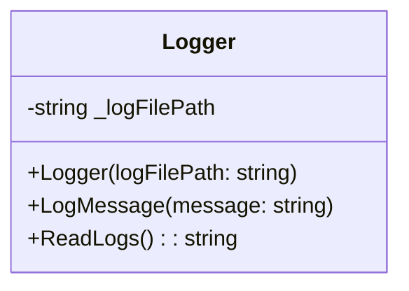
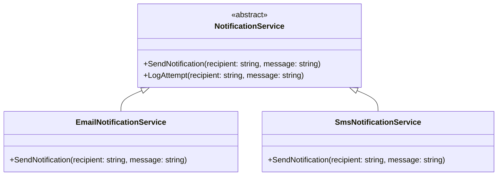
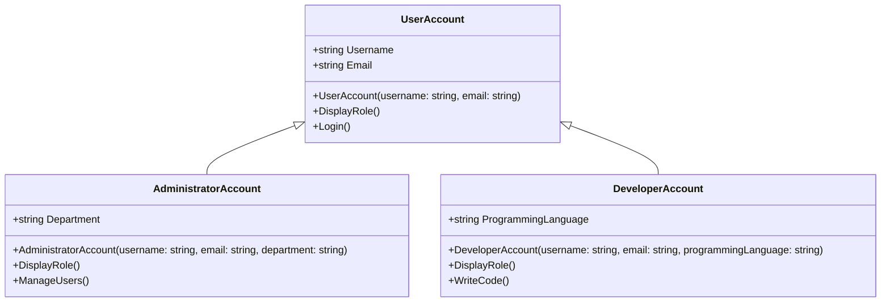
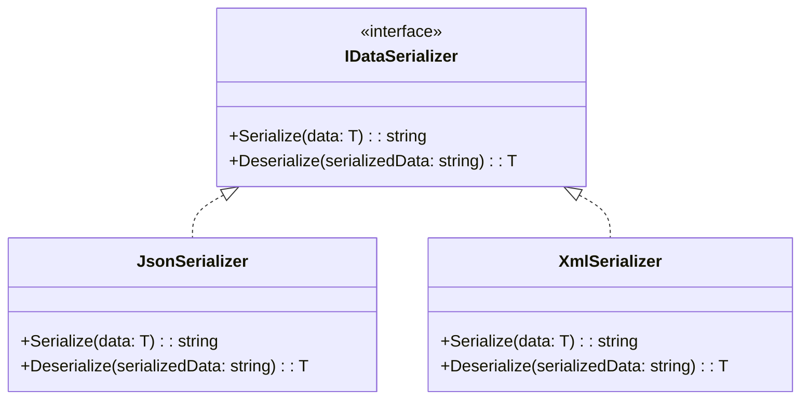

# Princípios da OOP em C#

A programação orientada a objetos (OOP) é um paradigma fundamental no desenvolvimento de software. Ela se baseia no conceito de "objetos", que são instâncias de "classes". Cada objeto pode conter dados (atributos) e comportamentos (métodos). Os quatro pilares que sustentam a OOP são Encapsulamento, Abstração, Herança e Polimorfismo. Cada um deles será explicado com exemplos práticos em C#.


----


## 1. Encapsulamento

O encapsulamento é um dos pilares fundamentais da Programação Orientada a Objetos (OOP), focado na proteção dos dados internos de um objeto. Ele controla como esses dados podem ser acessados e modificados, garantindo a integridade e a consistência do estado do objeto. Essencialmente, o encapsulamento empacota os dados (atributos) e os métodos (comportamentos) que operam sobre esses dados em uma única unidade, a classe, e restringe o acesso direto a alguns de seus componentes. Isso simplifica o uso da classe, pois os detalhes de implementação são ocultados do usuário.

**Exemplo em C# (Classe `Logger`):**

Neste exemplo prático, a classe `Logger` demonstra o encapsulamento. O caminho do arquivo de log (`_logFilePath`) é um detalhe interno e privado, inacessível diretamente de fora da classe. Métodos públicos como `LogMessage` e `ReadLogs` são fornecidos para interagir com o sistema de log. A forma como as mensagens são armazenadas e lidas do arquivo é completamente encapsulada dentro da classe `Logger`. Isso significa que qualquer componente externo que utilize a classe `Logger` não precisa se preocupar com os detalhes de implementação subjacentes, como a manipulação de arquivos, garantindo uma interface limpa e segura.

```c#
// Encapsulation: Logger
public class Logger
{
    private readonly string _logFilePath; // Encapsula o caminho do arquivo de log, tornando-o privado.

    public Logger(string logFilePath)
    {
        _logFilePath = logFilePath;
    }

    public void LogMessage(string message)
    {
        try
        {
            // A lógica interna para escrever no arquivo é encapsulada aqui.
            File.AppendAllText(_logFilePath, $"[{DateTime.Now}] {message}\n");
            Console.WriteLine($"Logged: {message}");
        }
        catch (Exception ex)
        {
            Console.WriteLine($"Error logging message: {ex.Message}");
        }
    }

    public string ReadLogs()
    {
        try
        {
            if (File.Exists(_logFilePath))
            {
                return File.ReadAllText(_logFilePath);
            }
            return "Log file does not exist.";
        }
        catch (Exception ex)
        {
            return $"Error reading logs: {ex.Message}";
        }
    }
}
```



---

## 2. Abstração

A abstração, no contexto da Programação Orientada a Objetos (OOP), concentra-se em focar no "o quê" (a funcionalidade) em vez do "como" (os detalhes de implementação). É o processo de ocultar a complexidade interna de um sistema ou componente, apresentando apenas a funcionalidade essencial ao usuário ou a outros componentes. Em C#, a abstração é frequentemente alcançada por meio de classes abstratas e interfaces, que definem um contrato de comportamento sem especificar a implementação completa desse comportamento.

**Exemplo em C# (Classes `NotificationService`, `EmailNotificationService`, `SmsNotificationService`):**

Neste exemplo, uma classe abstrata `NotificationService` foi criada para definir um contrato comum para diferentes tipos de serviços de notificação. Ela declara o método abstrato `SendNotification`, que deve ser implementado por qualquer subclasse concreta. Além disso, a classe abstrata inclui um método concreto `LogAttempt`, que é um comportamento comum a todas as notificações, independentemente do seu tipo específico de envio. Essa abordagem permite que diferentes tipos de serviços de notificação (como `EmailNotificationService` e `SmsNotificationService`) sejam utilizados de forma genérica, sem que o código cliente precise conhecer os detalhes específicos de como cada notificação é enviada. A abstração garante uma interface consistente e simplifica a interação com os serviços de notificação.

```c#
// Abstraction: Notification Service
public abstract class NotificationService // Classe abstrata que define um contrato para serviços de notificação.
{
    public abstract void SendNotification(string recipient, string message); // Método abstrato que deve ser implementado pelas subclasses.

    public void LogAttempt(string recipient, string message) // Método concreto, comum a todas as notificações.
    {
        Console.WriteLine($"Attempting to send notification to {recipient}: '{message}'");
    }
}

public class EmailNotificationService : NotificationService // Implementação concreta para envio de e-mail.
{
    public override void SendNotification(string recipient, string message)
    {
        LogAttempt(recipient, message);
        Console.WriteLine($"Sending email to {recipient}: {message}");
        // Aqui estaria a lógica real para enviar um e-mail.
    }
}

public class SmsNotificationService : NotificationService // Implementação concreta para envio de SMS.
{
    public override void SendNotification(string recipient, string message)
    {
        LogAttempt(recipient, message);
        Console.WriteLine($"Sending SMS to {recipient}: {message}");
        // Aqui estaria a lógica real para enviar um SMS.
    }
}
```




---

## 3. Herança

A herança é um dos pilares mais poderosos da Programação Orientada a Objetos (OOP), pois permite a reutilização de código e a criação de uma hierarquia de classes. Através da herança, uma nova classe, conhecida como classe derivada ou subclasse, pode adquirir as propriedades (atributos) e comportamentos (métodos) de uma classe existente, chamada classe base ou superclasse. Isso elimina a necessidade de reescrever o código comum para classes relacionadas, promovendo a modularidade e a manutenibilidade do software.

**Exemplo em C# (Classes `UserAccount`, `AdministratorAccount`, `DeveloperAccount`):**

Neste exemplo, diferentes tipos de contas de usuário foram modelados para ilustrar o conceito de herança. A classe `UserAccount` serve como a classe base, contendo propriedades e métodos que são comuns a todos os usuários, como `Username`, `Email` e o método `Login`. As classes `AdministratorAccount` e `DeveloperAccount` herdam de `UserAccount`, o que significa que elas automaticamente adquirem todas as funcionalidades da classe base. Além disso, cada classe derivada adiciona comportamentos específicos (`ManageUsers` para administradores, `WriteCode` para desenvolvedores) e propriedades (`Department`, `ProgrammingLanguage`) que são relevantes para seu papel. O método `DisplayRole` é sobrescrito em cada subclasse para personalizar a exibição do papel de cada tipo de conta, demonstrando como o comportamento pode ser especializado em classes derivadas.

```c#
// Inheritance: User Accounts
public class UserAccount // Classe base para todos os tipos de contas de usuário.
{
    public string Username { get; set; }
    public string Email { get; set; }

    public UserAccount(string username, string email)
    {
        Username = username;
        Email = email;
    }

    public virtual void DisplayRole() // Método virtual que pode ser sobrescrito pelas subclasses.
    {
        Console.WriteLine($"User: {Username}, Email: {Email}");
    }

    public void Login() // Método comum a todas as contas de usuário.
    {
        Console.WriteLine($"{Username} logged in.");
    }
}

public class AdministratorAccount : UserAccount // AdministratorAccount herda de UserAccount.
{
    public string Department { get; set; }

    public AdministratorAccount(string username, string email, string department) : base(username, email) // Chama o construtor da classe base.
    {
        Department = department;
    }

    public override void DisplayRole() // Sobrescreve o método DisplayRole para administradores.
    {
        Console.WriteLine($"Administrator: {Username}, Email: {Email}, Dept: {Department}");
    }

    public void ManageUsers() // Método específico de administradores.
    {
        Console.WriteLine($"Administrator {Username} is managing users.");
    }
}

public class DeveloperAccount : UserAccount // DeveloperAccount herda de UserAccount.
{
    public string ProgrammingLanguage { get; set; }

    public DeveloperAccount(string username, string email, string programmingLanguage) : base(username, email)
    {
        ProgrammingLanguage = programmingLanguage;
    }

    public override void DisplayRole() // Sobrescreve o método DisplayRole para desenvolvedores.
    {
        Console.WriteLine($"Developer: {Username}, Email: {Email}, Lang: {ProgrammingLanguage}");
    }

    public void WriteCode() // Método específico de desenvolvedores.
    {
        Console.WriteLine($"Developer {Username} is writing code in {ProgrammingLanguage}.");
    }
}
```




---


## 4. Polimorfismo

Polimorfismo, que significa "muitas formas", é a capacidade de um objeto assumir múltiplas formas. Na prática, este
pilar da Programação Orientada a Objetos (OOP) permite que objetos de diferentes classes sejam tratados de maneira
uniforme, desde que compartilhem uma classe base comum ou implementem a mesma interface. Isso é fundamental para
escrever código flexível, extensível e de fácil manutenção, pois permite que um único ponto de interação lide com
diversas implementações de forma transparente.

**Exemplo em C# (Interfaces `IDataSerializer`, `JsonSerializer`, `XmlSerializer`):**

Neste exemplo, foi definida uma interface `IDataSerializer` que estabelece um contrato para serializar e desserializar
dados. Em seguida, foram criadas duas implementações concretas dessa interface: `JsonSerializer` e `XmlSerializer`.
Ambas as classes aderem ao contrato da `IDataSerializer`, mas a forma como realizam a serialização e a desserialização
dos dados é intrinsecamente diferente. Isso demonstra o polimorfismo em ação: é possível utilizar qualquer um dos
serializadores de forma intercambiável através da interface `IDataSerializer`. Por exemplo, ao ter uma lista de objetos
do tipo `IDataSerializer` e chamar o método `Serialize` em cada um, o comportamento correto (serialização JSON ou XML)
será executado dinamicamente em tempo de execução, sem a necessidade de verificar o tipo concreto de cada objeto.

```c#
// Polymorphism: Data Serializers
public interface IDataSerializer // Interface que define o contrato para serializadores de dados.
{
    string Serialize<T>(T data);
    T Deserialize<T>(string serializedData);
}

public class JsonSerializer : IDataSerializer // Implementação para serialização JSON.
{
    public string Serialize<T>(T data)
    {
        Console.WriteLine($"Serializing data to JSON...");
        // Em uma aplicação real, seria usada uma biblioteca como System.Text.Json ou Newtonsoft.Json.
        return ${"{{ \"type\": \"{typeof(T).Name}\", \"data\": \"{data.ToString()}\" }}"};
    }

    public T Deserialize<T>(string serializedData)
    {
        Console.WriteLine($"Deserializing data from JSON...");
        // Em uma aplicação real, seria usada uma biblioteca para analisar JSON.
        return default(T);
    }
}

public class XmlSerializer : IDataSerializer // Implementação para serialização XML.
{
    public string Serialize<T>(T data)
    {
        Console.WriteLine($"Serializing data to XML...");
        // Em uma aplicação real, seria usada uma biblioteca como System.Xml.Serialization.
        return $"<root><type>{typeof(T).Name}</type><data>{data.ToString()}</data></root>";
    }

    public T Deserialize<T>(string serializedData)
    {
        Console.WriteLine($"Deserializing data from XML...");
        // Em uma aplicação real, seria usada uma biblioteca para analisar XML.
        return default(T);
    }
}
```




--- 

## Classe Principal (Program.cs)

A classe `Program` contém o método `Main`, que é o ponto de entrada de qualquer aplicação C#. Neste laboratório, o método `Main` é utilizado para demonstrar a aplicação prática dos quatro pilares da Programação Orientada a Objetos (OOP) e a utilização das estruturas de dados discutidas. Cada seção do código no `Main` é dedicada a um conceito específico, permitindo a visualização do comportamento e da interação entre as classes e interfaces desenvolvidas.

## Executando o Programa

Para executar o programa e observar a saída no console, siga os passos:

1.  **Navegue até o diretório do projeto:** Abra um terminal ou prompt de comando e navegue até o diretório raiz do projeto `OOP` (onde o arquivo `OOP.csproj` está localizado).

2.  **Execute o comando:** Digite o seguinte comando e pressione Enter:

    ```bash
    dotnet run --project OOP/OOP.csproj
    ```

    Este comando compila e executa a aplicação, exibindo os resultados das demonstrações de OOP e estruturas de dados diretamente no console.

---


# Comparação de Estruturas de Dados em C#

Nesta seção, são comparadas as três estruturas de dados mais comuns em C#: Arrays (Matrizes), Lists (Listas) e Dictionaries (Dicionários/Mapas). É fundamental entender as diferenças entre elas para escolher a estrutura mais adequada para cada cenário no desenvolvimento de software. A escolha correta da estrutura de dados pode impactar significativamente a performance e a manutenibilidade do código.

| Característica / Estrutura | Arrays (Matrizes) | Lists (Listas) | Dictionaries (Dicionários/Mapas) |
| :------------------------- | :---------------- | :--------------- | :--------------------------------- |
| **Definição**              | Uma coleção de elementos de tamanho fixo e tipo homogêneo, armazenados em posições de memória contíguas. São utilizados quando o número de elementos é conhecido e fixo, proporcionando acesso direto e eficiente. | Uma coleção dinâmica de elementos de tipo homogêneo, que pode crescer ou diminuir de tamanho conforme a necessidade. Oferece grande flexibilidade para adicionar ou remover itens, sendo uma escolha versátil para a maioria dos cenários. | Uma coleção de pares chave-valor, onde cada chave é única e mapeia para um valor. É ideal para cenários onde é necessário buscar informações rapidamente por uma chave específica, como em registros de banco de dados ou configurações. |
| **Tamanho**                | Fixo (definido na inicialização). Uma vez criado, seu tamanho não pode ser alterado. Qualquer tentativa de adicionar mais elementos do que a capacidade alocada resultará em erro ou exigirá a criação de um novo array. | Dinâmico (pode ser redimensionado). A lista gerencia automaticamente seu tamanho interno, realocando memória conforme necessário. Isso simplifica o gerenciamento de coleções de tamanho variável. | Dinâmico (pode ser redimensionado). O dicionário ajusta sua capacidade conforme pares chave-valor são adicionados ou removidos, otimizando o armazenamento e a performance de busca. |
| **Acesso a Elementos**     | Por índice (baseado em zero). O acesso é muito rápido, quase em tempo constante (O(1)), pois os elementos estão em posições contíguas na memória. Isso o torna ideal para operações de leitura frequentes. | Por índice (baseado em zero). O acesso também é rápido (O(1)), similar aos arrays, devido à sua implementação subjacente que geralmente utiliza arrays. | Por chave. O acesso é extremamente rápido (O(1) em média), independentemente do número de elementos, devido ao uso de tabelas hash. Isso o torna eficiente para operações de busca e recuperação. |
| **Ordem**                  | Mantém a ordem de inserção. Os elementos são armazenados na ordem em que são adicionados, e essa ordem é preservada. | Mantém a ordem de inserção. Os elementos permanecem na ordem em que são adicionados, o que é útil para coleções onde a sequência é importante. | Não garante a ordem de inserção (historicamente). Embora a partir do .NET 5, `Dictionary<TKey, TValue>` mantenha a ordem de inserção, não se deve depender disso para ordenação, pois o propósito principal é a busca por chave. |
| **Uso Comum**              | Arrays são usados quando o número de elementos é conhecido e fixo, e é necessária alta performance para acesso direto, como em buffers de dados ou matrizes matemáticas. | Listas são usadas quando o número de elementos é variável e é preciso adicionar ou remover elementos frequentemente, como em listas de itens de carrinho de compras ou logs de eventos. | Dicionários são usados quando é necessário mapear chaves para valores e buscar informações rapidamente por uma chave específica, como em caches, configurações de aplicativos ou índices de dados. |
| **Vantagens**              | Eficiente em memória e acesso muito rápido por índice. Ideal para coleções de tamanho fixo e operações de leitura intensivas. | Flexível, fácil de adicionar e remover elementos. Muito versátil para a maioria dos cenários de coleção de dados. | Busca extremamente rápida por chave, chaves únicas garantem integridade e eficiência na recuperação de dados. Ideal para mapeamentos e dicionários de termos. |
| **Desvantagens**           | Tamanho fixo, o que torna o redimensionamento custoso (cria um novo array e copia os elementos). Inserções e exclusões no meio do array são ineficientes. | Inserções ou remoções no meio da lista podem ser lentas (O(n)), pois exigem o deslocamento de elementos subsequentes. | Consome mais memória que arrays ou listas para armazenar as chaves e os valores, devido à sobrecarga da tabela hash. |

## Exemplos de Código C#

### Arrays (Matrizes)
```c#
int[] numbers = new int[3];
numbers[0] = 10;
numbers[1] = 20;
numbers[2] = 30;
Console.WriteLine(numbers[1]); // Saída: 20
```

### Lists (Listas)
```c#
List<string> names = new List<string>();
names.Add("Alice");
names.Add("Bob");
names.Remove("Alice");
Console.WriteLine(names[0]); // Saída: Bob
```

### Dictionaries (Dicionários/Mapas)
```c#
Dictionary<string, int> ages = new Dictionary<string, int>();
ages.Add("Alice", 30);
ages.Add("Bob", 25);
Console.WriteLine(ages["Alice"]); // Saída: 30
ages["Charlie"] = 35; // Adiciona ou atualiza
```


---


# Referências
* [Propriedades (Guia de Programação C#) - Microsoft Learn](https://learn.microsoft.com/pt-br/dotnet/csharp/programming-guide/classes-and-structs/properties)
* [Modificadores de Acesso (Guia de Programação C#) - Microsoft Learn](https://learn.microsoft.com/pt-br/dotnet/csharp/programming-guide/classes-and-structs/access-modifiers)
* [Classes e Membros Abstratos e Selados (Guia de Programação C#) - Microsoft Learn](https://learn.microsoft.com/pt-br/dotnet/csharp/programming-guide/classes-and-structs/abstract-and-sealed-classes-and-class-members)
* [Interfaces (Guia de Programação C#) - Microsoft Learn](https://learn.microsoft.com/pt-br/dotnet/csharp/fundamentals/types/interfaces)
* [Herança (Guia de Programação C#) - Microsoft Learn](https://learn.microsoft.com/pt-br/dotnet/csharp/fundamentals/object-oriented/inheritance)
* [base (Referência de C#) - Microsoft Learn](https://learn.microsoft.com/pt-br/dotnet/csharp/language-reference/keywords/base)
* [Polimorfismo (Guia de Programação C#) - Microsoft Learn](https://learn.microsoft.com/pt-br/dotnet/csharp/fundamentals/object-oriented/polymorphism)
* [virtual (Referência de C#) - Microsoft Learn](https://learn.microsoft.com/pt-br/dotnet/csharp/language-reference/keywords/virtual)
* [override (Referência de C#) - Microsoft Learn](https://learn.microsoft.com/pt-br/dotnet/csharp/language-reference/keywords/override)
* [Arrays (Guia de Programação C#) - Microsoft Learn](https://learn.microsoft.com/pt-br/dotnet/csharp/language-reference/builtin-types/arrays)
* [Classe List<T> - Microsoft Learn](https://learn.microsoft.com/pt-br/dotnet/api/system.collections.generic.list-1)
* [Classe Dictionary<TKey, TValue> - Microsoft Learn](https://learn.microsoft.com/pt-br/dotnet/api/system.collections.generic.dictionary-2)


